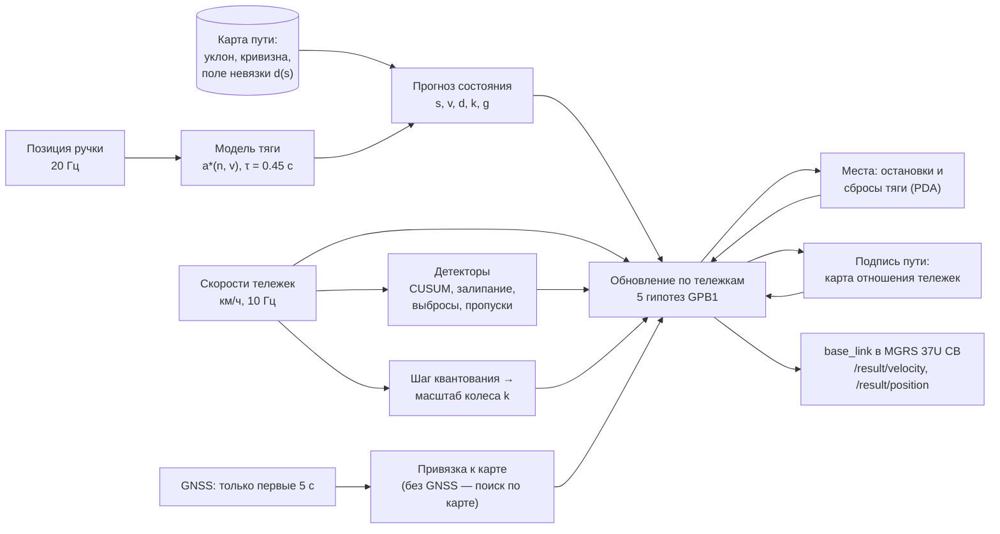

# Резервная одометрия трамвая по модели

Решение кейса «Резервная одометрия по модели» Московского транспортного хакатона (сентябрь 2026). Нода ROS 2 Humble оценивает
скорость и положение трамвая по скоростям двух тележек и позиции ручки контроллера, без GNSS и IMU в контуре.
Она публикует `/result/velocity` и `/result/position` в реальном времени, пока проигрывается bag.

## Идея в одном абзаце

Мы строим **модель движения** (что должно происходить при данной позиции ручки на данном месте пути) и **фильтр с гипотезами
о датчиках** (какой тележке сейчас верить). Путь считается вдоль **собственной карты пути**, а всё, что повторяется
по месту, превращено в измерения положения: остановки у платформ и сигналов, места сброса тяги, «подпись пути» в
отношении скоростей тележек, шероховатость у стрелки. Масштаб колеса определяется по шагу квантования скорости
тележки, а вагон и эпоха колёс распознаются сами. Каждое решение проверено на отложенных бэгах и на проверочном бэге
организаторов их же кодом — в том числе вживую, в Docker под лимитами жюри.

## Архитектура



## Что мы узнали из данных

Решение выросло из разбора данных; каждая находка ниже изменила модель или проверку.

- **Скорости тележек — в км/ч**, а не в м/с, как написано в описании топиков: отношение к скорости GNSS 3.596.
- **Привод отрабатывает уставку силы, а не ускорения.** Уклон действует с коэффициентом ≈ g/(1+ρ) — поправкой на
  вращающиеся массы. Отсюда модель: таблица a\*(n, v) и инерционное звено τ = 0.452 с.
- **Скорость тележки квантована, и шаг выдаёт масштаб колеса:** q = c·(1 + k). Внутри эпохи колёс вагона c постоянна,
  после обточки прыгает на 4.4–4.7 %. Масштаб колеса, который из колёс и модели не наблюдаем, читается прямо из шага.
- **Масштаб колеса у разных вагонов и дат различается до ±1.6 %** — без калибровки это 16 м ухода на километр.
- **Около 2 % времени движения ручка противоречит движению** (например, −8 при разгоне) — модель не может верить
  ручке слепо.
- **В данных есть реальные сбои:** залипшая на нуле задняя тележка, проскальзывания. Их повторяет набор сбоев.
- **25 пар бэгов — дубли.** Без их удаления сплит «train/val» протекал бы.
- **Эталон судьи запаздывает** относительно входов: выход выровнен на 0.10 с по скорости и 0.08 с по положению.
- **Отношение скоростей передней и задней тележек повторяется по месту** — кривые, стыки, стрелки. Это «подпись
  пути», по которой положение уточняется между остановками, а съезд в тупик отличается от главного пути.

## Как это работает

- **Модель тяги:**
  - выученная таблица ускорения a*(позиция ручки, скорость) с инерционным звеном;
  - коэффициент реализации тяги, возмущение (уклон и сопротивление);
  - поле невязки по месту.
- **Фильтр Калмана с пятью гипотезами о датчиках:** норма, сбой передней тележки, сбой задней, сбой обеих («только
  модель»), манёвр. Проскальзывание и юз ловит CUSUM с откатом на модель. Залипание, выбросы, пропуски, сбои меток
  времени и контроллера — отдельные детекторы.
- **Положение — по своей карте пути.** Путь вдоль карты, x/y/z — из карты. Дрейф гасят «виртуальные балисы»:
  49 мест остановок и 4 места сброса тяги, вероятностная ассоциация. Масштаб колеса — ещё и по шагу квантования
  скорости тележки: вагон и эпоха колёс определяются сами. Между балисами путь поправляется по выученной карте
  отношения скоростей тележек — «подписи пути» (кривые, стыки, стрелки).
- **GNSS** используется только в первые 5 с — для привязки к карте. Если GNSS нет вовсе, нода находит себя
  на карте по остановкам.
- **Выход** — `base_link` (ось первой тележки) в MGRS 37U CB, как у судьи.

## Результаты

Карта и калибровки для проверки — только по обучающим бэгам. Подробности — в `docs/REPORT.md`.

| | |
|---|---|
| Код проверки организаторов на их бэге | скорость RMSE 0.027 м/с, положение `base_link` 3-D RMSE 0.63 м |
| Наш отложенный набор (17 бэгов, эталон RTK) | скорость 0.029 м/с медиана, `base_link` 3-D 0.66 м медиана; дрейф 0.006 % пройденного |
| Сбои входа, 49 сценариев × 7 бэгов | «разошедшихся» прогонов 9 из 343 (без механизмов защиты — 53) |
| Живой прогон ROS 2 под `--cpus=2 --memory=512m`, бэг организаторов целиком (22 мин) | задержка p99 1.6 мс (максимум 13 мс), 40 Гц, CPU 1.6 % ядра в среднем (максимум 3.8 %), память 28 МиБ; их `metrics.py` рядом с нодой: скорость 0.026 м/с, 3-D 0.65 м |

### Путь точности на проверочном бэге организаторов

Их код, их эталон `/localization/kinematic_state`; каждая строка — отдельное проверенное изменение (`docs/REPORT.md` §1a):

| Сборка | Скорость, м/с | Положение 3-D, м | Максимум, м | Без GNSS, м |
|---|---|---|---|---|
| до проверки организаторов | 0.061 | 5.78 | 49.6 | — |
| + тупик у западной конечной в карте и распознавание съезда | 0.061 | 1.20 | 9.5 | — |
| + выход выровнен по запаздыванию эталона судьи | 0.028 | 1.12 | 9.5 | 2.27 |
| + масштаб колеса по шагу квантования скорости | 0.027 | 0.96 | 9.5 | 1.64 |
| + раннее решение о тупике и поправка его начала | 0.027 | 0.82 | 4.5 | 1.56 |
| + поправки между балисами по карте отношения тележек | **0.027** | **0.63** | **4.2** | **0.68** |

## Что сделано сверх минимума

- **Честная проверка.** Сплит без утечки (дубли бэгов выброшены), карты, балисы, поля и калибровки для проверки —
  только по train. Проверка кодом организаторов повторена офлайн (`tools/replay/eval_checker.py`) и запущена вживую
  рядом с нодой в Docker; числа совпали.
- **Набор сбоев:** 49 сценариев × 7 бэгов, 9914 внесённых событий — проскальзывание, юз, залипание, пропуски, выбросы,
  шум, сбои меток и контроллера. Разошедшихся 9 из 343, без механизмов защиты было 53; ложных тревог на 5.6 ч
  чистых данных нет.
- **Согласованность и целостность:** калиброванная дисперсия скорости (покрытие 95 %-интервала 0.957) и 99 %-я
  граница ошибки вдоль пути (покрытие 0.989); пороги CUSUM проверены теорией и Монте-Карло (`docs/CONSISTENCY.md`).
- **Работа без GNSS:** сеточный поиск места по остановкам, сбросам тяги и огибающей скорости — первая позиция через
  ~3 мин, дальше точность как с GNSS.
- **Реальное время:** одно C++-ядро для ноды и реплея, без выделения памяти на горячем пути; живой прогон — задержка
  p99 около 1.6 мс при лимите 100 мс.
- **Продукты на тех же оценках:** износ и калибровка колёс, жёсткие торможения, профиль скорости, экодрайвинг
  (`docs/PRODUCTS.md`), демо внесения сбоев (`docs/DEMO.md`).
- **Исследование до кода:** восемь обзоров (~5 000 строк, `research/`) — одометрия рельсового экипажа при
  проскальзывании, сопротивление и сцепление, модель тягового привода, сопоставление с картой без GNSS, методы
  оценивания, реальное время ROS 2, прецеденты и датасеты.
- **Журнал решений:** `docs/DECISIONS.md` — все принятые и отвергнутые решения с числами, включая идеи, которые
  проверили и не взяли.

## Сборка и запуск

```bash
git clone https://github.com/Kvascs/67-time-to-win-hack.git
cd 67-time-to-win-hack
docker build -t tram_backup_odometry .
```

Сборка без Docker (ROS 2 Humble, `colcon build`), запуск, проверка задержки и точности описаны в `docs/JURY.md`.

## Документы

| Файл | Что внутри |
|---|---|
| `docs/JURY.md` | инструкция для жюри: сборка, запуск, топики, проверка |
| `docs/MODEL.md` | математическая модель и все механизмы |
| `docs/PARAMETERS.md` | допущения, ограничения и все настраиваемые параметры (начальная позиция, масса, колесо, сопротивление, пороги, фильтр) |
| `docs/REPORT.md` | отчёт о точности и задержке, абляция, чувствительность |
| `docs/DECISIONS.md` | журнал всех решений: принятые, отвергнутые, хронология с числами |
| `docs/LIMITATIONS.md` | ограничения и план развития |
| `docs/CONSISTENCY.md` | согласованность фильтра, калибровка неопределённости, пороги CUSUM |
| `docs/CRITERIA_CHECK.md` | сверка с критериями оценки |
| `docs/PRODUCTS.md`, `docs/DEMO.md` | продукты на тех же оценках и демо внесения сбоев |

## Структура

| Путь | Что |
|---|---|
| `ros2_ws/src/tram_backup_odometry` | нода `tbo_node`, C++-ядро (`core/`), параметры, карты (`maps/`), launch |
| `ros2_ws/src/tram_backup_odometry_tools` | `latency_probe`, `evaluate_run` |
| `ros2_ws/src/tbo_msgs`, `ros2_ws/src/tram_vehicle_msgs` | статус оценщика; сообщения организаторов |
| `tools/` | офлайн-реплей и оценка, построение карты, модель тяги, набор сбоев |
| `analysis/` | анализ данных, карты для честной проверки (только по обучающим бэгам), проверки идей |
| `research/` | обзоры литературы и методов, на которых построено решение |
