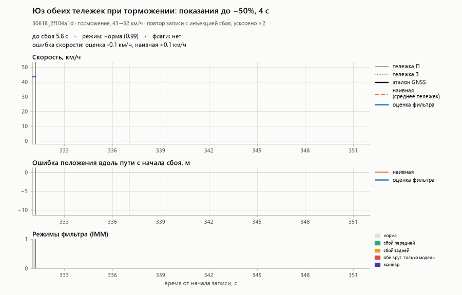
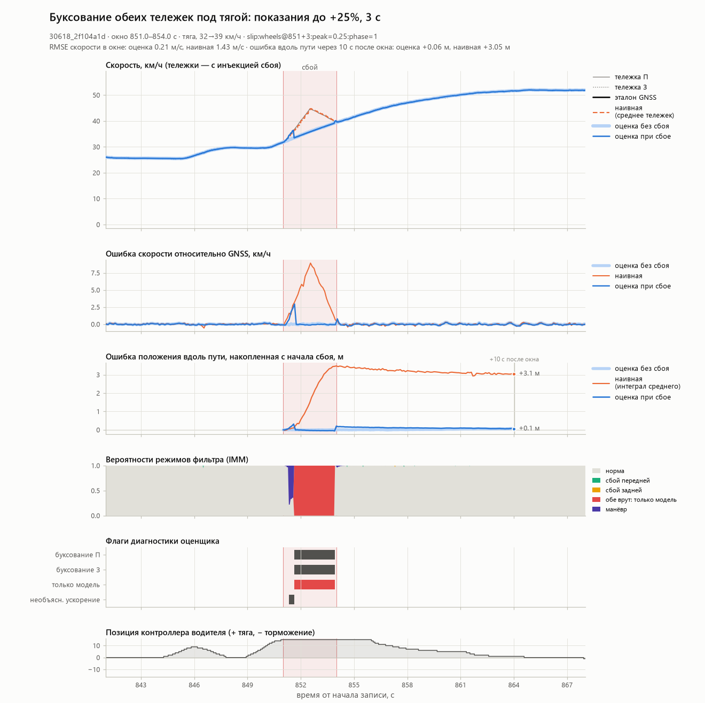
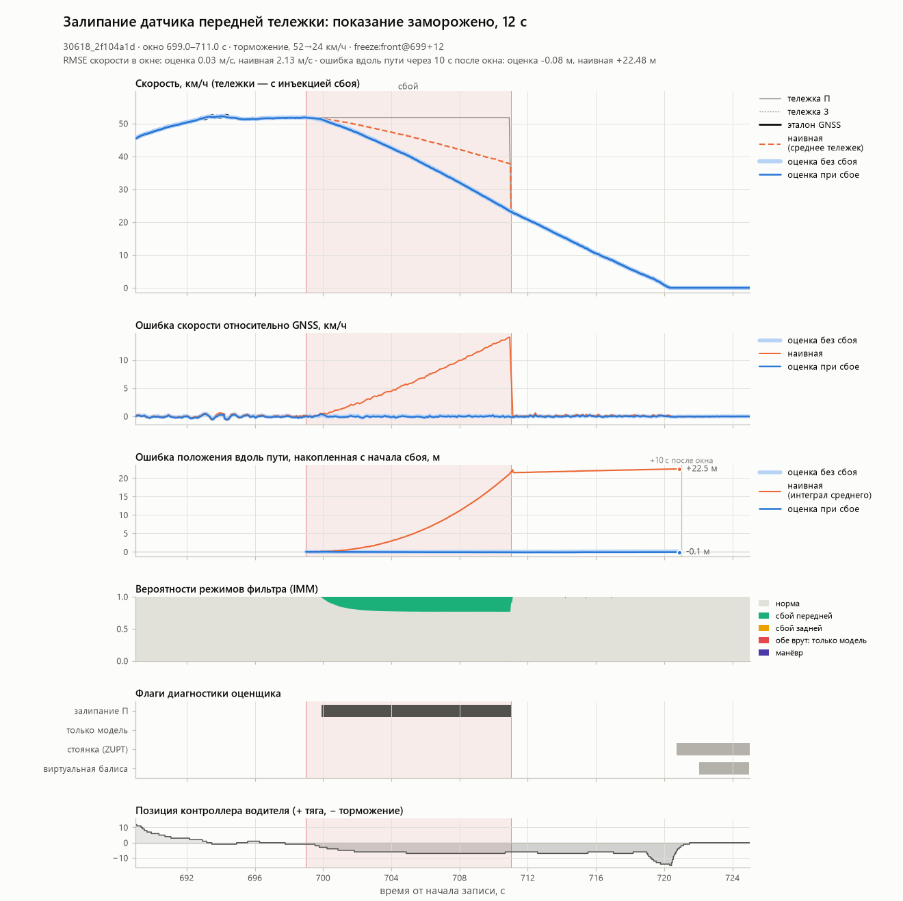
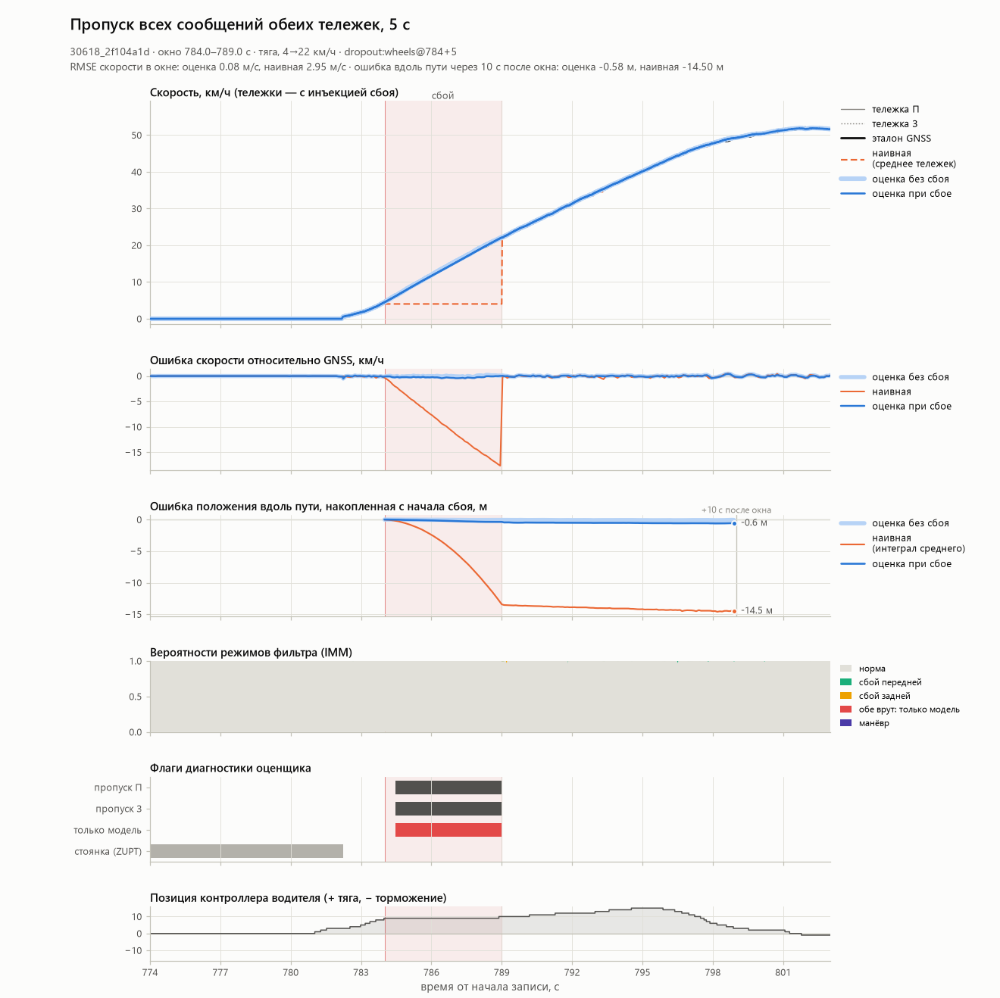

# Демонстрация: сбои датчиков в живом прогоне

> **Статус: черновик (прерван по команде «стоп», 2026-09-26).** Витрина прогнана полностью, все числа ниже
> взяты из `tools/demo/out/showcase_metrics.md` / `.csv` (сгенерированы `python tools/demo/showcase.py`,
> 1173 с). Не сделано — см. раздел «Что осталось» в конце.

Инструмент берёт реальную запись из отложенной выборки (val), портит входы оценщика — скорости тележек —
и прогоняет тот же C++-оценщик, что работает в ROS-ноде, дважды: на исходных данных и на испорченных.
Эталон GNSS не трогается. Для каждого окна сбоя строится рисунок, для самого показательного окна — анимация.
Считается таблица: насколько ошиблась бы наивная одометрия (среднее двух тележек) и насколько ошибся фильтр.

Снимок оценщика и входы:

- бинарник `build_core/tbo_replay_fix5.exe` (md5 `43203c9223abc0a7629144fbcf4168d2`) — ядро с исправлениями
  устойчивости (совместная тревога только по обеим тележкам, опорная траектория для медленного буксования,
  устойчивое к шуму восстановление, выход из стоянки, восстановление по одной тележке, залипание за 0.8 с);
- карты **только по train-бэгам** — `analysis/validation_maps`: путь, ветки, балисы, места отсечки тяги
  и поле возмущений `dfield.csv`. Траекторий val в картах нет;
- таблица тяги `ros2_ws/src/tram_backup_odometry/config/traction_lut.csv`, остальные параметры — значения
  по умолчанию бинарника (совпадают с `config/params.yaml`);
- GNSS подаётся только первые 5 с, как у жюри. Оценщик публикует положение антенны 1 в ENU от первого фикса
  (`output_frame=enu`, `base_link_along_m=0`, `base_link_height_m=0`), чтобы сравнивать его с антенной master.

## Главное

Три записи val (два вагона: 30618 и 30639), на каждой один и тот же физически согласованный набор сбоев,
окна поставлены на реальные разгоны и торможения. Сравнение с наивной одометрией (среднее двух тележек),
которая получает те же испорченные входы.

| Сбой (3 записи) | RMSE скорости в окне, м/с: фильтр | наивная | Ошибка вдоль пути через 10 с после окна, м: фильтр | наивная | Реакция, с |
|---|---|---|---|---|---|
| Совместное буксование под тягой, +25 %, 3 с, 31–44 км/ч | 0.18–0.23 | 1.36–1.60 | +0.06…+0.30 | +2.9…+3.9 | 0.20–0.73 |
| Совместный юз при торможении, −50 %, 4 с, с 38–44 км/ч | 0.15–0.27 | 2.59–3.18 | −0.39…0.00 | −7.9…−9.5 | 0.12–0.20 |
| Залипание датчика одной тележки, 12 с, торможение с 45–52 км/ч | 0.03–0.04 | 2.13–2.51 | −0.10…0.00 | +22.5…+26.8 | 0.83–0.93 |
| Пропуск обеих тележек, 5 с, разгон с места до 21–22 км/ч | 0.04–0.08 | 2.69–2.95 | −0.58…−0.03 | −13.1…−14.5 | 0.48–0.57 |
| Выбросы ±20 км/ч в 5 % сообщений обеих тележек, 30 с | 0.03 | 0.39–0.47 | +0.03…+0.20 | −1.6…+1.6 | 0.35–1.23 |

Во всех 15 окнах основного набора фильтр держит скорость с RMSE ≤ 0.27 м/с (наивная — 0.39–3.18 м/с),
а ошибка положения, накопленная за окно и 10 с после него, не превышает 0.6 м (у наивной — до 27 м).

Анимации (по одной на запись):

- совместный юз при торможении — `tools/demo/out/30618_2f104a1d/live_w02_slide_wheels.gif` (0.38 МБ);
- совместное буксование под тягой — `tools/demo/out/30618_22c1c589/live_w01_slip_wheels.gif` (0.40 МБ);
- пропуск обеих тележек при разгоне — `tools/demo/out/30639_d927f360/live_w04_dropout_wheels.gif` (0.35 МБ).









Остальные рисунки: `tools/demo/out/<запись>/wNN_<вид>_<вход>.png`, таблица по записи — `metrics.md`,
все числа с источниками — `metrics.json` / `metrics.csv` там же.

## Полная таблица витрины

| Запись | # | Сбой | Режим, км/ч | RMSE скорости в окне, м/с<br>фильтр / наивная | Вдоль пути через 10 с после окна, м<br>фильтр / наивная | Реакция, с |
|---|---|---|---|---|---|---|
| 30618_2f104a1d | 1 | Буксование обеих тележек под тягой: до +25 %, 3 с | тяга, 32→39 | **0.21** / 1.43 | **+0.06** / +3.05 | 0.31 |
| 30618_2f104a1d | 2 | Юз обеих тележек при торможении: до −50 %, 4 с | торможение, 43→32 | **0.15** / 3.00 | **−0.31** / −9.51 | 0.20 |
| 30618_2f104a1d | 3 | Залипание датчика передней тележки, 12 с | торможение, 52→24 | **0.03** / 2.13 | **−0.08** / +22.48 | 0.93 |
| 30618_2f104a1d | 4 | Пропуск всех сообщений обеих тележек, 5 с | тяга, 4→22 | **0.08** / 2.95 | **−0.58** / −14.50 | 0.48 |
| 30618_2f104a1d | 5 | Выбросы обеих тележек: ±20 км/ч в 5 % сообщений, 30 с | тяга, 13→41 | **0.03** / 0.47 | **+0.03** / −1.62 | 1.23 |
| 30618_2f104a1d | 6 | **Граница:** буксование обеих тележек до +30 %, 5 с, на малой скорости | тяга, 10→27 | **0.94** / 0.87 | **+3.90** / +3.30 | — |
| 30618_22c1c589 | 1 | Буксование обеих тележек под тягой: до +25 %, 3 с | тяга, 37→44 | **0.18** / 1.60 | **+0.23** / +3.91 | 0.20 |
| 30618_22c1c589 | 2 | Юз обеих тележек при торможении: до −50 %, 4 с | торможение, 38→27 | **0.18** / 2.59 | **0.00** / −7.90 | 0.20 |
| 30618_22c1c589 | 3 | Залипание датчика задней тележки, 12 с | торможение, 47→17 | **0.04** / 2.34 | **0.00** / +25.18 | 0.87 |
| 30618_22c1c589 | 4 | Пропуск всех сообщений обеих тележек, 5 с | тяга, 4→21 | **0.06** / 2.86 | **−0.48** / −14.44 | 0.57 |
| 30618_22c1c589 | 5 | Выбросы обеих тележек: ±20 км/ч в 5 % сообщений, 30 с | выбег, 30→31 | **0.03** / 0.41 | **+0.20** / +0.06 | 0.37 |
| 30639_d927f360 | 1 | Буксование обеих тележек под тягой: до +25 %, 3 с | тяга, 31→40 | **0.23** / 1.36 | **+0.30** / +2.92 | 0.73 |
| 30639_d927f360 | 2 | Юз обеих тележек при торможении: до −50 %, 4 с | торможение, 44→34 | **0.27** / 3.18 | **−0.39** / −9.41 | 0.12 |
| 30639_d927f360 | 3 | Залипание датчика передней тележки, 12 с | торможение, 45→15 | **0.04** / 2.51 | **−0.10** / +26.81 | 0.83 |
| 30639_d927f360 | 4 | Пропуск всех сообщений обеих тележек, 5 с | тяга, 3→21 | **0.04** / 2.69 | **−0.03** / −13.06 | 0.51 |
| 30639_d927f360 | 5 | Выбросы обеих тележек: ±20 км/ч в 5 % сообщений, 30 с | тяга, 11→23 | **0.03** / 0.39 | **+0.20** / +1.57 | 0.35 |

Спецификации сбоев (время — секунды от начала записи), seed 0:

- 30618_2f104a1d: `slip:wheels@851+3:peak=0.25:phase=1, slide:wheels@337+4:peak=0.5:phase=-1, freeze:front@699+12, dropout:wheels@784+5, spike:wheels@1084+30:p=0.05:amp=20, slip:wheels@169+5:peak=0.3:phase=1`
- 30618_22c1c589: `slip:wheels@782+3:peak=0.25:phase=1, slide:wheels@227+4:peak=0.5:phase=-1, freeze:rear@278+12, dropout:wheels@639+5, spike:wheels@1015+30:p=0.05:amp=20`
- 30639_d927f360: `slip:wheels@601+3:peak=0.25:phase=1, slide:wheels@910+4:peak=0.5:phase=-1, freeze:front@223+12, dropout:wheels@146+5, spike:wheels@838+30:p=0.05:amp=20`

## Где фильтр не помогает

Когда врут обе тележки сразу, фильтр может опираться только на модель привода по позиции контроллера.
Совместное буксование или юз распознаётся, только если колёса показывают ускорение, которого привод
или тормоз физически дать не могут. Умеренный совместный юз неотличим от экстренного торможения:
режим «манёвр» специально верит колёсам, чтобы не потерять настоящее экстренное торможение.
Медленное буксование на малой скорости выглядит как чуть более сильный разгон. В обоих случаях фильтр
идёт за колёсами и ошибается как наивная оценка — не лучше и почти не хуже.

Прогон чувствительности на 30618_2f104a1d (только метрики, `tools/demo/out/sensitivity_30618_2f104a1d/`).
«Лишнее ускорение колёс» — пик × скорость в начале / половина окна: насколько быстрее вагона
разгоняются (или тормозятся) колёса на нарастании треугольного профиля.

| Сбой | v в начале, км/ч | Лишнее ускорение колёс, м/с² | RMSE в окне, м/с<br>фильтр / наивная | Вдоль пути +10 с, м<br>фильтр / наивная | «Только модель», с |
|---|---|---|---|---|---|
| `slide:wheels@390+4:peak=0.3` | 30 | 1.26 | 1.24 / 1.18 | −2.33 / −3.30 | 0.0 |
| `slide:wheels@1115+4:peak=0.25` | 39 | 1.34 | 1.36 / 1.33 | −4.41 / −3.56 | 0.0 |
| `slide:wheels@186+4:peak=0.3` | 33 | 1.38 | 1.33 / 1.27 | −4.50 / −3.80 | 0.0 |
| `slide:wheels@977+4:peak=0.4` | 30 | 1.66 | 1.66 / 1.62 | −5.59 / −5.01 | 0.0 |
| `slide:wheels@262+3:peak=0.5` | 37 | 3.45 | **0.23** / 2.57 | **+0.11** / −5.69 | 2.6 |
| `slip:wheels@440+4:peak=0.3` | 9 | 0.36 | 0.80 / 0.71 | +3.01 / +1.89 | 0.0 |
| `slip:wheels@226+3:peak=0.3` | 11 | 0.64 | 0.82 / 0.76 | +2.16 / +1.56 | 0.0 |
| `slip:wheels@1051+3:peak=0.3` | 17 | 0.92 | **0.43** / 1.00 | **+0.80** / +2.31 | 1.7 |
| `slip:wheels@320+2:peak=0.3` | 12 | 0.97 | **0.30** / 0.72 | +0.42 / +0.34 | 1.1 |
| `slip:wheels@853+4:peak=0.2` | 37 | 1.02 | **0.27** / 1.32 | **+0.95** / +4.07 | 2.8 |
| `slip:wheels@686+3:peak=0.25` | 38 | 1.74 | **0.21** / 1.68 | **+0.74** / +3.86 | 2.4 |

По этому прогону совместное буксование ловится, когда колёса разгоняются быстрее вагона примерно
на 0.9 м/с² и больше. Совместный юз ловится при «лишнем» замедлении около 3.5 м/с², а при 1.3–1.7 м/с²
фильтр принимает его за экстренное торможение. Это одна запись и 11 окон, граница оценочная.

Ещё одно наблюдение по рисунку выбросов (30618_2f104a1d, окно 5): выбросы на обеих тележках надолго
зажигают флаг «контроллер не согласован» — ложная тревога детектора контроллера. На оценку скорости
это не влияет (RMSE 0.03 м/с), но в диагностике это шум.


## Как читать рисунок окна

Каждый PNG — одно окно сбоя: 10 с до начала, само окно и 14 с после. Окно залито розовым.

1. **Скорость, км/ч.** Чёрная линия — эталон GNSS (доплеровская скорость антенны master). Серые линии —
   показания тележек, которые получил оценщик (уже с инъекцией). Оранжевый пунктир — наивная оценка,
   среднее двух тележек. Синяя линия — оценка фильтра при сбое. Светло-синяя подложка — та же оценка
   на исходных данных: где синяя линия лежит на подложке, сбой на оценку не повлиял.
2. **Ошибка скорости относительно GNSS, км/ч.** Те же три оценки минус эталон.
3. **Ошибка положения вдоль пути, накопленная с начала сбоя, м.** Точка справа — значение через 10 с
   после окна, его и берёт таблица. Наивное положение — интеграл наивной скорости от эталонного
   положения в начале окна. Положение фильтра — опубликованная позиция, спроецированная на путь.
4. **Вероятности режимов фильтра.** Пять гипотез о датчиках (см. `docs/MODEL.md`, §5.1): норма,
   сбой передней, сбой задней, обе врут (только модель), манёвр (экстренное торможение вне контроллера).
5. **Флаги диагностики**, которые нода публикует в `/result/status`: буксование, юз, пропуск,
   залипание, «только модель» и т. д. Показаны флаги, которые хоть раз загорелись на интервале рисунка.
6. **Позиция контроллера водителя**: выше нуля — тяга, ниже — торможение.

GIF-анимация показывает окно так, как его видит оператор в реальном времени: данные появляются слева
направо (ускорено в 2 раза), в строке состояния — текущий режим фильтра, горящие флаги и текущие ошибки
скорости и положения обеих оценок.

## Как повторить

Нужны извлечённые записи (`data/npz/<bag>.npz`, `python tools/extract_bags.py`) и Python с numpy, pandas,
matplotlib и Pillow. Все команды — из корня репозитория.

```bash
# вся витрина: 3 записи + прогон чувствительности -> tools/demo/out/   (~20 мин на загруженном ноутбуке)
python tools/demo/showcase.py

# одна запись, свой набор сбоев (формат tools/harness/faults.py, сбои через запятую)
python tools/demo/fault_demo.py --bag 30618_2f104a1d \
    --faults "slip:wheels@851+3:peak=0.25:phase=1,dropout:wheels@784+5" --out tools/demo/out/my_run

# где в записи тяга и торможение (кандидаты для окон с готовыми спецификациями)
python tools/demo/fault_demo.py --bag 30618_2f104a1d --suggest
```

Формат сбоя: `вид:вход@начало+длительность[:параметр=значение...]`. Начало — секунды от начала записи
или процент (`40%`). Вход: `front`, `rear`, `wheels` (обе тележки), `cmd`, `inputs` (всё).
Виды: `slip`, `slide`, `freeze`, `zero`, `dropout`, `spike`, `noise`, `nan`, `scale`, `delay`,
`stamp_jump`, `stamp_zero`, `dup`. `phase=1` сдвигает начало окна на первый момент тяги, `phase=-1` —
торможения, и ограничивает буксование или юз этой фазой.

Полезные ключи `fault_demo.py`: `--seed` (случайность выбросов, по умолчанию 0), `--after` (горизонт
«после окна», 10 с), `--gif-window N` (какое окно анимировать; по умолчанию — где наивная оценка ошиблась
сильнее всего относительно фильтра), `--no-gif`, `--no-png`, `--exe`, `--maps`, `--no-dfield`,
`--set ключ=значение` (параметр оценщика). Одновременно идут не больше двух прогонов бинарника
(чистый и со сбоями).

На Linux бинарник собирается из того же ядра (`docs/JURY.md`, §6), по умолчанию берётся
`build_core/tbo_replay`. Числа этого документа получены на снимке fix5; другое ядро даст другие числа.

## Определения

- **RMSE скорости** — как в основном отчёте: каждому сообщению доплеровской скорости master сопоставляется
  выход оценщика с ближайшей меткой `header.stamp` (не дальше 50 мс). «В окне» — эталонные отсчёты внутри
  окна сбоя, «после» — следующие 10 с.
- **Наивная оценка** — среднее последних показаний передней и задней тележек без какой-либо фильтрации
  (при пропуске держится последнее значение). Она получает те же испорченные входы.
- **Ошибка вдоль пути** — разность дуговых координат оценки и эталона на эталонном пути этой же записи,
  отсчитанная от начала окна. Эталон положения — RTK-фиксы master (status 2), прошедшие проверку
  согласованности с доплеровской скоростью с порогом 1.5 м. Порог отсекает редкие сбои приёмника:
  фикс с устаревшим положением, после которого фиксы несколько секунд приходят с задержкой ~0.4 с
  (ступенька 2–3 м по пути). Отброшено 0.2–0.5 % фиксов записи.
- **Реакция** — время от начала окна до первого флага аномалии или падения P(норма) ниже 0.5, которых
  нет в прогоне без сбоя в тот же момент.
- **«Только модель», с** — сколько времени на интервале «окно + 10 с» горел флаг `MODEL_ONLY`.

## Что осталось (черновик прерван)

- Просмотрены глазами не все рисунки: проверены окно буксования 30618_2f104a1d и кадры анимации юза;
  рисунки 30618_22c1c589 и 30639_d927f360 и две другие анимации не просмотрены.
- `metrics.json` и `showcase.json` этого прогона записаны до исправления сериализации и могут содержать
  `NaN` вместо `null` (Python их читает; в коде уже исправлено, повторный прогон даст строгий JSON).
- Ложную тревогу «контроллер не согласован» при выбросах проверить на остальных записях и передать
  разработчикам ядра.
- Границу распознавания совместного юза и буксования оценили по одной записи. Для отчёта жюри стоит
  повторить прогон чувствительности на второй записи.
