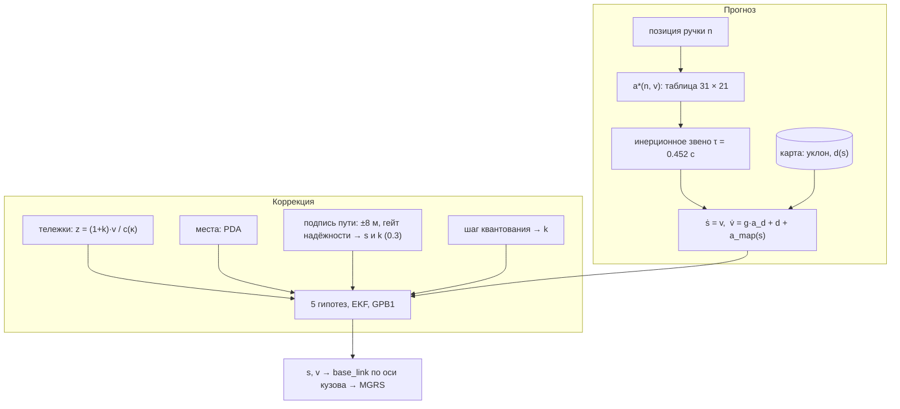

# Математическая модель и алгоритм резервной одометрии

**Кратко.** Скорость и положение трамвая оцениваются фильтром Калмана с несколькими гипотезами (GPB1, 5 режимов).
Прогноз строится по нелинейной модели тягового привода и продольной динамики. Вход прогноза — позиция контроллера,
к ней добавляются уклон пути и выученное по прогонам «поле невязки» из карты. Коррекция идёт по скоростям
передней и задней тележек. Каждая тележка проверяется отдельно: проскальзывание, юз, залипание, пропуски.
Положение одномерное, вдоль пути по карте, построенной офлайн из GNSS-треков. Дрейф ограничивают «виртуальные
балисы»: остановки в известных местах и точки сброса тяги. Через них же на ходу калибруется масштаб колеса.
GNSS используется только в первые 5 с после первого фикса: для привязки к карте и определения направления.

Код ядра: `ros2_ws/src/tram_backup_odometry/core/` (C++17, без зависимостей). Нода ROS 2 — тонкая обёртка над ним.
Все числа ниже — значения по умолчанию из `config/params.yaml` (файл генерируется из реестра параметров ядра).
Допущения и ограничения модели — `docs/PARAMETERS.md` §1–2 и `docs/LIMITATIONS.md`, параметры — `docs/PARAMETERS.md` §3.

### Идеи, на которых стоит решение

1. **Физика плюс данные.** Форма модели — физическая: привод задаёт силу, ускорение отстаёт на инерционное звено,
   уклон действует с поправкой на вращающиеся массы. Числа — выучены по данным методом ошибки выхода. Что модель
   не объясняет, забирают адаптивные состояния: коэффициент тяги g (масса и загрузка) и возмущение d.
2. **Датчикам не доверяем по умолчанию.** Сбой тележки — не флаг, а гипотеза с вероятностью. Пять гипотез
   (норма, сбой передней, задней, обеих, манёвр) идут параллельно, а медленные совместные сбои ловит CUSUM с
   откатом на модельную траекторию.
3. **Положение — одномерное по карте.** Трамвай не может сойти с пути, поэтому 3-D задача сводится к одной
   координате — пути вдоль карты; поперёк и по высоте положение даёт карта.
4. **Всё, что повторяется по месту, — измерение.** Остановки у платформ и сигналов, места сброса тяги, подпись
   пути в отношении скоростей тележек, шероховатость у стрелки — это «виртуальные балисы», не требующие
   оборудования на линии.
5. **Наблюдаемость — честно.** Масштаб колеса из колёс и модели не наблюдаем (видно только произведение с g),
   поэтому он — состояние Шмидта: колёса его не трогают. Калибруют его места и шаг квантования скорости тележки,
   а слабо, с усилением 0.3, — ещё и поправки по подписи пути.
6. **Проверка без утечки.** Всё, что строится по данным, для проверки строится только по train; каждое изменение —
   A/B одной сборкой на val, train и наборе сбоев, итог — кодом организаторов на их бэге.

---

## 1. Входы и выходы

| | Сигнал | Частота | Примечание |
|---|---|---|---|
| вход | `/vehicle/front_bogie_velocity`, `/vehicle/rear_bogie_velocity` | ~10 Гц | **в км/ч** (README ошибочно пишет м/с; проверено по GNSS: отношение 3.596) |
| вход | `/vehicle/driver_position_cmd` | 20 Гц | позиция n ∈ [−15, +15] |
| вход (только инициализация) | `/sensing/gnss/{master,rover}/fix` | 10 Гц | используются 5 с от первого фикса, затем нода **отписывается** |
| выход | `/result/velocity` (`VelocitySensor`) | ~40 Гц | продольная скорость, м/с |
| выход | `/result/position` (`nav_msgs/Odometry`) | ~40 Гц | `base_link` в системе карты Autoware (MGRS 37U CB), ориентация, ковариации |
| выход | `/result/status` (`tbo_msgs/EstimatorStatus`), `/diagnostics` | ~40 / 1 Гц | флаги проскальзывания/юза, вероятности режимов, λ, сцепление, задержка |

Время — это `header.stamp` входных сообщений. Часы стенда в расчётах не используются.

## 2. Модель тягового привода

Идентификация на обучающих бэгах показала: привод отрабатывает **уставку силы** (момента), а не ускорения.
Коэффициент при уклоне ≈ g/(1+ρ), а не 0. Поэтому модель такая.

**Установившееся тяговое/тормозное ускорение** на ровном пути задаётся таблицей
a\*(n, v): 31 позиция контроллера × 21 узел скорости (0…20 м/с), файл `config/traction_lut.csv`.

Таблица включает основное сопротивление движению: при n = 0 выбег по Дэвису, A = 0.023 м/с², B = 0.0056 1/с.
Подобрана методом **ошибки выхода** (дифференцируемая симуляция открытого прогноза) со штрафами на гладкость
и монотонность. Физически она описывает:
- тягу с постоянной силой ≈ 1.0–1.1 м/с² до ~6.4 м/с, затем постоянную мощность P/m ≈ 7.1 Вт/кг;
- долю используемой огибающей по позиции: x(n) = 0.14 (1), 0.33 (3), 0.57 (5), 0.76 (7), 0.88 (10), 1.0 (15);
- торможение a ≈ −(0.20 + 0.098·|n|)·h(v), где h(v) растёт от ~0.5 на остановке до 1 при 2.5 м/с.

**Переход «момент → скорость»** — инерционное звено первого порядка без чистого запаздывания
(перебор запаздываний 0…0.6 с дал оптимум d = 0):

  ȧ_d = (a\*(n(t), v) − a_d) / τ,  τ = 0.452 с.

На стоянке при v ≈ 0 и n ≤ 0 уставка обнуляется: тормоз удерживает, а не толкает назад.

**Момент, вал и коэффициенты привода.** Момент в таблице задан в единицах ускорения — сила тяги на единицу массы.
Радиус колеса, передаточное число и потери в приводе входят в таблицу, выученную по движению, а вагон и загрузку
учитывает коэффициент g (§3). Угловая скорость вала при постоянном передаточном числе пропорциональна скорости
колеса, поэтому второй аргумент таблицы — v. Ограничение момента — огибающая «постоянная сила ≈ 1.0–1.1 м/с²,
затем постоянная мощность P/m ≈ 7.1 Вт/кг», коэффициенты привода — доля огибающей x(n) по позиции.

## 3. Продольная динамика

  ṡ = v
  v̇ = g · a_d + d + a_map(s) + w_a
  a_map(s) = − k_g(режим) · ī(s) + d_field(s)

- **g** — коэффициент реализации тяги (масса и загрузка вагона), адаптируется онлайн. У 30618 ≈ 0.97, у 30639 ≈ 1.07–1.09.
- **d** — возмущение: остаток ошибки модели, ветер. Случайное блуждание, физически ограничено:
  не более +0.6 м/с² под тягой (больше — это проскальзывание, а не движение) и не менее −4 м/с²
  (экстренный или рельсовый тормоз).
- **ī(s)** — уклон из карты, **усреднённый по кузову**: 5 точек от −2.1 до +14.4 м относительно антенны 1,
  потому что масса распределена по ~16.5 м. Уклон на маршруте от −4.1 % до +3.6 %.
  Коэффициенты k_g = 8.22 / 7.98 / 7.36 м/с² на единицу уклона для торможения / выбега / тяги, то есть
  g/(1+ρ), ρ ≈ 0.2 — влияние вращающихся масс. Без уклона ошибка 10-секундного прогноза без колёс
  вырастает с 0.60 до 0.91 м/с.
- **d_field(s)** — «поле невязки»: медиана необъяснённого ускорения в ячейках по 10 м вдоль главного цикла,
  выученная по прогонам (`tools/model/learn_dfield.py`, файл `maps/dfield.csv`). В нём ошибки профиля уклона,
  сопротивление в кривых и типичное поведение в конкретном месте. Амплитуда небольшая
  (|d_field| медиана 0.023, p95 0.08 м/с²). Проверка на val по полю, выученному на train: в окнах по 10 с
  без колёс ошибка скорости 0.732 → 0.715 м/с, ошибка пути за окно 3.71 → 3.63 м.
- **w_a** — белый шум ускорения σ_a = 0.12 м/с². Ошибка прогноза без колёс растёт как ≈ 0.11·√H м/с,
  это проверено на отложенных бэгах для H = 1…30 с.

Точность модели без колёс на отложенных бэгах (скорость, RMSE, м/с): **0.09 / 0.20 / 0.26 / 0.37 / 0.53**
на горизонтах 1 / 3 / 5 / 10 / 30 с. Для сравнения, «держать последнюю скорость»: 0.54 / 1.49 / 2.29 / 3.81 / 6.00.

Где в модели факторы продольной динамики из ТЗ:

| Фактор | Где учтён |
|---|---|
| масса | коэффициент g, адаптируется онлайн (`docs/PARAMETERS.md` §3.2) |
| эффективный радиус колеса | масштаб колеса k (§4); радиус как число не нужен — тележки выдают скорость |
| передаточные коэффициенты, потери в приводе | внутри таблицы a\*(n, v) (§2) |
| сопротивление качению | выбег по Дэвису в таблице: A = 0.023 м/с², B = 0.0056 1/с (§2) |
| аэродинамическое сопротивление | отдельно не выделено: в выбеге таблицы и в возмущении d (ветер) |
| сопротивление в кривых | в поле невязки d_field(s) (`curve_resist_coef` = 0) |
| уклон | k_g · ī(s), усреднение по кузову |
| тормозные силы | тормозная ветвь таблицы (§2); d ≥ −4 м/с² (экстренный, рельсовый тормоз); режим M (§5.1) |
| ограничение по сцеплению | d ≤ +0.6 м/с² под тягой, большее — проскальзывание (§5); `adhesion_used` (§7) |

## 4. Модель измерений (одометрия)

Для каждой тележки i ∈ {перед, зад}:

  z_i = (1 + k) · v / c(κ(s + Δ_i)) + ε_i,  ε_i ~ N(0, 0.05² + (0.004·v)²) (м/с)²

- Пересчёт км/ч → м/с: 1.00037/3.6. Это калибровка на прямых участках обучающих бэгов.
- **c(κ) = 1 + min(0.415·|κ|, 0.009) − 0.054·κ** — поправка на кривизну: в кривых колёса недомеряют путь,
  эффект насыщается на ~0.9 % при R < 60 м. Кривизна κ берётся **в месте каждой тележки**:
  Δ = +9.873 м (передняя) и +2.323 м (задняя) от антенны 1 (TF организаторов, база тележек 7.55 м).
  Тележки входят в кривую в разные моменты.
- **k** — погрешность масштаба колеса (износ, настройка датчика). По данным она меняется от вагона и даты
  до ±1.6 %, а внутри прогона постоянна. Из колёс и модели наблюдаемо только произведение (1+k)·g,
  поэтому k — **«учитываемое» состояние Шмидта**: обновление по колёсам его не меняет (коэффициент усиления 0),
  а калибруют его ориентиры на карте (§6.3) через корреляцию s–k и, с уменьшенным усилением, поправки по подписи
  пути (§6.7). Априорная σ_k = 1.5 %: она покрывает разброс парка, и первые же балисы подстраивают масштаб. Ещё
  одно прямое измерение k даёт шаг квантования скорости тележки (§6.6).

## 5. Оценщик

Вектор состояния x = [s, v, d, k, g]. Прогноз интегрируется шагами ≤ 50 мс (явный Эйлер с точной
обработкой остановки внутри шага), ковариация — по якобиану (EKF). Обновление в форме Джозефа.

Входы оценщика: модельное ускорение g·a_d + a_map(s) (§2–3), скорости передней и задней тележек z_i (§4),
текущая оценка состояния x с ковариацией P, параметры модели (`config/params.yaml`, таблица тяги, карта).
Выход — продольная скорость v и путь s. Путь — интеграл скорости, его правят балисы (§6.3) и поправки по подписи
пути (§6.7); из s строится положение (§6.4).

Обновление по колёсам не трогает ни k (состояние Шмидта, §4), ни путь s. Коэффициент усиления s через масштаб
колеса, (P_sv(1+k) + P_sk·v)/S, — малая разность двух больших величин порядка «пройденный путь × P_kk».
Линеаризация масштаба не держит её в равновесии при смене скорости. Без балис остаток двигал s на 0.4–0.6 м
за отсчёт, до 96 м назад за прогон без GNSS. Путь — интеграл скорости, положение правят только балисы.
Навязанная скорость (стоянка, перепривязка к колёсам, откат) вводится как скалярное измерение v на раскрытом
априоре, а не обнулением строки ковариации, поэтому ковариация остаётся согласованной.

### 5.1. Пять гипотез о датчиках (GPB1)

| Режим | Какие тележки верны | Динамика |
|---|---|---|
| N — норма | обе | σ_a = 0.12 |
| F — сбой передней | задняя | σ_a = 0.12 |
| R — сбой задней | передняя | σ_a = 0.12 |
| B — сбой обеих | ни одна → **только модель** | σ_a = 0.12, \|d\| ≤ 0.6 |
| M — манёвр | обе | быстрое d (σ_a = 0.5, q_d = 8): экстренное торможение вне контроллера |

- Правдоподобие «неисправной» тележки равномерное на ±15 м/с, со знаком: под тягой проскальзывающее колесо
  врёт вверх, при торможении юзящее — вниз; невозможный знак штрафуется.
- Переходы — марковская цепь с интенсивностями 0.05 (в сбой одной) / 0.01 (обеих) / 0.7 (возврат) /
  0.01 (манёвр) 1/с. При большом усилии (|a\*| > 0.5 или |n| ≥ 8) интенсивность перехода в сбой ×4.
  Опционально — ×(до 4) в местах с плохим сцеплением по карте сбоев (`fault_prior_file`; в поставке выключено).
- После каждого обновления апостериорные оценки режимов сливаются (моменты), и все режимы стартуют из общей
  оценки. Полное IMM-смешивание давало «перезахват» буксующих колёс: фильтр нормального режима успевал
  подстроиться под врущие колёса.

### 5.2. Детекторы аномалий входа

| Аномалия | Признак | Реакция |
|---|---|---|
| выброс, NaN, отрицательное, > 110 км/ч | проверка значения | отбрасывается, флаг `*_INVALID` |
| скачок | \|Δz/Δt\| > 6 м/с² (физически невозможно) | штраф режимам, доверяющим этой тележке |
| залипание | одинаковое ненулевое значение ≥ 0.8 с | тележка исключается, `*_STUCK` |
| «ноль при движении» | тележка = 0, а другая > 0.5 м/с (залипание на старте, заклинившая ось) | тележка исключается, `*_STUCK` |
| пропуск | нет сообщений > 0.6 с | `*_DROPOUT`, при пропуске обеих — только модель |
| проскальзывание одной тележки | режимы F/R | не используется, флаг `*_SLIP` / `*_SLIDE`, λ = (z − v)/v |
| совместное проскальзывание/юз | CUSUM Пейджа по (ускорение колеса за 0.3 с − ускорение модели), порог 0.3 м/с | **откат** s и v на модельную траекторию от начала аномалии и защёлка «только модель» (см. ниже) |
| контроллер врёт | абсолютное ускорение колёс невозможно для позиции (разгон на тормозной позиции, сильное торможение под тягой), CUSUM, допуск 0.5 м/с² | позиция контроллера не используется 8 с, доверие колёсам, `CMD_INCONSISTENT` |
| экстренный или рельсовый тормоз | колёса согласованно замедляются сильнее модели | режим M, `UNMODELED_ACCEL` |
| стоянка | все живые тележки < 0.15 км/ч в течение 0.25 с при v < 1.2 м/с | v = 0, s заморожено (ZUPT) |
| пропуск контроллера | нет сообщений > 0.6 с | позиция считается нейтральной, `CMD_DROPOUT` |

Подробности совместного детектора и восстановления. Все пункты найдены на прогонах с внесёнными сбоями,
49 сценариев × 7 бэгов, `tools/anomaly_sim`:
- **Опорное ускорение** = g·a_d + d_опоры + уклон и поле невязки из карты, как в динамике фильтра. Без члена карты
  уклон 3 % съедал до половины допуска CUSUM.
  - Под тягой (проскальзывание, допуск +0.6 м/с²) опора — медленная копия возмущения d (τ = 20 с). Иначе быстрый
    d фильтра «подтягивается» за буксующими колёсами за ~0.4 с, и медленная рампа проходит незамеченной.
  - При торможении (юз, допуск −0.8 м/с²) опора — собственный d фильтра. Ошибка тормозной таблицы меняется
    на ~1 м/с² за одно торможение, пока тормоз нарастает. Медленная опора отставала и давала ложный юз
    у остановки: 4 из 69 реальных прогонов, до 100 м ошибки.
  - Если шум тележек высокий (среднеквадратичная разность «перед − зад» > 0.1 м/с, в 4 раза выше натурального),
    при торможении тоже берётся медленная опора: d фильтра при сильном шуме сам шумит.
- **Одна тревога.** Тревога одной тележки считается совместной, только если вторая действительно выбыла
  (пропуск или залипание). Иначе это момент между приходом пары сообщений W0 и W1 с одной меткой.
- **Выход из защёлки.** Колёса вернулись к модели: две выборки в пределах max(0.3 м/с, 4 %). Через 10 с —
  перепривязка к колёсам. Ниже 2 м/с защёлка юза не ставится: у остановки юз стоит меньше 1 м пути, а ложная
  защёлка «везёт» модель через всю стоянку.
- **Восстановление после долгой аномалии.** Согласие тележек проверяется по сглаженным скоростям
  (τ = 2 с), поэтому шум датчиков не держит фильтр в режиме «только модель». Если жива только одна тележка
  и её долго отвергали, фильтр перепривязывается к ней. В режиме «только модель» |d| ≤ 0.6 м/с².
- **Трогание без колёс.** Если обе тележки молчат, а контроллер даёт тягу, стоянка снимается и работает модель.

Итог на наборе сбоев: число «разошедшихся» прогонов (ошибка скорости > 5 м/с или дрейф > 100 м)
53 → 9 из 343, точность на чистых данных без изменений.

Признаки проскальзывания из ТЗ и где они проверяются:

| Признак | Где |
|---|---|
| резкий рост скорости колёс без ускорения по модели | скачок \|Δz/Δt\| > 6 м/с²; CUSUM по разности «ускорение колеса − модельное» |
| несоответствие передней и задней тележек | режимы F/R (§5.1), флаги `*_SLIP` / `*_SLIDE`, λ = (z − v)/v |
| высокий тяговый момент при низкой производной скорости | невязка «колёса − модель» (§7) в CUSUM и в детекторе «контроллер врёт»; при \|a\*\| > 0.5 или \|n\| ≥ 8 интенсивность перехода в сбой ×4 |
| отрицательное рассогласование при торможении | правдоподобие со знаком (юзящее колесо врёт вниз), CUSUM юза с допуском −0.8 м/с² |
| аномально высокая дисперсия | шум измерений растёт со скоростью (§4); при СКО разности «перед − зад» > 0.1 м/с — медленная опора CUSUM; согласие тележек — по сглаженным скоростям (τ = 2 с) |

### 5.3. Время и порядок сообщений

- Сообщения не по порядку переупорядочиваются буфером фиксированного запаздывания 0.3 с по `header.stamp`.
  Выход на любой момент считается сразу: подтверждённое состояние + события буфера + прогноз, без задержки
  на буфер. Сообщения старше буфера: колёса отбрасываются (`LATE_DATA`), позиция контроллера учитывается.
- **Скачки времени.** Метка дальше 5 с вперёд или 10 с назад от текущего времени — сбой, если её не
  подтверждает второе сообщение в пределах 1 с. Подтверждённый скачок назад (bag проигран заново) или вперёд
  ≥ 60 с (другой bag) начинает новый прогон: сброс и новое окно GNSS. Более короткий скачок вперёд (все входы
  молчали) модель перекрывает прогнозом. Одиночная мусорная метка отбрасывается, и на её метке выход
  не публикуется.
- Пороги взяты из данных: метки заголовков непрерывны (разрыв ≤ 0.23 с во всех 122 бэгах), а порядок прихода
  скачет на 2.6 с вперёд и 2.7 с назад в стартовой пачке и на ~1 с в середине записи.

## 6. Положение

Представление — путь s вдоль карты pathgraph (дистанция вдоль пути с проекцией на её ось); наружу — точка
`base_link` в MGRS 37U CB (§6.4). Абсолютная привязка — по GNSS в первые 5 с или поиском по карте без GNSS (§6.2);
относительная одометрия от старта включается параметром `nognss_relative`.

### 6.1. Карта (pathgraph)

Карта строится офлайн по GNSS-трекам (`analysis/map_build`, `tools/map/export_core_map.py`):
- основной замкнутый цикл через оба разворотных кольца, L = 11 053 м;
- ответвления: объезд 625 м и веерные пути F2, F3 на западной конечной;
- тупиковый путь `west_arrival_2` (125 м) у западной конечной: на нём кончаются некоторые записи (раздел 6.5);
- профиль высоты, уклона и кривизны.

В поставке — карта по всем бэгам с GNSS. Для честной проверки на val используется карта только по train
(`analysis/validation_maps`). RTK-фиксы отложенных прогонов лежат в 0.9 см от оси train-карты (медиана), p90 — 23 см.

### 6.2. Инициализация (5 с GNSS от первого фикса; без GNSS — поиск по карте)

- Окно отсчитывается от **первого фикса**, а не от первого сообщения. Стартовая пачка приносит историю колёс
  и контроллера на 2–6 с старше, и GNSS может начаться позже колёс.
- Медиана фиксов master проецируется на карту: кандидаты — все локальные минимумы расстояния на основном
  цикле и на ответвлениях. Выбирается ближайший кандидат, согласованный по направлению с базой антенн
  master → rover (12.44 м, разброс направления 0.01°).
- Пройденный путь берётся **на момент медианной метки фиксов** из истории (t, s) за 30 с. Трамвай может
  тронуться внутри окна: в 27 из 86 длинных бэгов движение начинается в первые 5 с.
- Если трамвай стоит на ответвлении, маршрут идёт по нему до слияния, дальше — по основному циклу.
- Неопределённость привязки (1 м + 0.7 × расстояние до карты) добавляется в дисперсию s.
- После окна нода отписывается от GNSS-топиков. Есть тест: выход побитово совпадает при GNSS-сообщениях
  после окна и без них.
- **Если GNSS нет вовсе** (за 4 с ни одного фикса), включается глобальная привязка без GNSS
  (`src/global_localizer.cpp`). Это сеточный фильтр по месту старта u0 на главном цикле и масштабу колеса κ:
  51 строка × 22 тыс. ячеек по 0.5 м, координата u — путь по колёсам без поправки на кривизну.
  Признаки:
  - остановка ≥ 1.5 с: смесь «одно из 49 мест с вероятностью остановки p_m» против равномерной случайной остановки;
  - проезд известного места без остановки: множитель (1 − p_m);
  - сброс тяги в одном из 4 мест;
  - проезд места сброса на позиции ≥ 4 без сброса;
  - огибающая скорости по месту.

  Фикс — масса ≥ 0.99 в окне ±10 м при не менее чем двух положительных признаках. После фикса фильтр
  привязывается к карте, как по GNSS. κ передаётся, только если он хорошо определён (σ < 0.3 %), иначе масштаб
  калибруют балисы. До фикса положение не публикуется. На val без GNSS: первая позиция через 194 с (медиана),
  затем 3-D RMSE 1.23 м — как с GNSS. Это замер на момент появления глобальной привязки; в сдаваемой сборке,
  с поправками по подписи пути (§6.7), медиана 3-D RMSE на val без GNSS — 0.665 м.

### 6.3. Виртуальные балисы

- **Остановки**: 49 мест с повторяемым положением стоянки — 18 платформ, 28 сигналов, 3 конечных, разброс 0.2–0.6 м.
- **Сбросы тяги**: 4 места, где водители резко снимают тягу (n ≥ 4 → 0), вероятно перед секционными
  изоляторами контактной сети. Разброс 0.5–2.5 м.

Событие — стоянка ≥ 1.5 с или сброс тяги на ходу. Каждому месту l в гейте 3σ даётся вес
w_l = p_stop,l · N(Δs_l; 0, σ_s² + r_l). Гипотеза «случайное место» (15 % для остановок, 5 % для сбросов)
получает вес w_0 с равномерной плотностью по ширине гейта. Обновление — **вероятностная ассоциация (PDA)**:

  β_l = w_l / (w_0 + Σw), ν = Σ β_l ν_l,
  P⁺ = β_0 P⁻ + (1 − β_0) P_c + K (Σ β_l ν_l² − ν²) Kᵀ.

Два близких места (например, 3433 и 3439 м) смешиваются, а не выбирается одно. Неопределённость не схлопывается
на, возможно, неверном месте. Обновление делается, если 1 − β_0 ≥ 0.6. Через корреляцию s–k оно же
калибрует масштаб колеса; шаг k за одно обновление ограничен 0.4 %. Прямое измерение k — по шагу квантования (§6.6).

Для решения об ассоциации (гейт, веса w_l, ширина гипотезы «случайное место») к σ_s² добавляется запас q·L.
Здесь L — путь с последнего фикса места (балиса, сброс тяги или глобальная привязка), q = 0.008 м²/м
(`landmark_assoc_q`). Одометрия между балисами уходит от места к месту на −0.41…+0.48 % (5–95 % отрезков train) —
больше, чем говорит σ_s, и без запаса верная балиса после такого ухода отвергалась. Само обновление использует
дисперсию фильтра.

### 6.4. Публикация

- **Система координат** — карта Autoware: MGRS, квадрат 37U CB (x = E − 300 000, y = N − 6 100 000 в UTM 37N;
  x продолжается за 100 км в соседний квадрат DB, как в примере организаторов 37UCB035858 → x = 103 501.63),
  z — высота (REP-103). Режимы `enu`, `utm`, `map` оставлены для проверок.
- **Точка** — `base_link`: ось поворота передней тележки, по высоте — точка касания колеса и рельса. По TF
  организаторов антенна 1 (master) стоит в base_link на x = −9.873 м, z = +3.0 м, антенна 2 (rover) — на
  x = +2.563 м, z = +3.0 м. Кузов жёсткий, поэтому точка строится по оси кузова — прямой через обе антенны.
  Берутся точки карты в месте антенны 1 (s) и антенны 2 (s + 12.436 м). `base_link` лежит на этой прямой
  в 9.873 м впереди антенны 1; высота — высота карты в этой точке минус 3.0 м. Точка карты «на 9.873 м дальше
  по пути» не годится: в петлях R ≈ 16 м путь антенны уходит на ~0.7 м наружу рельсов. Наша независимая
  подгонка по данным (хорда «курс кузова ↔ база 7.55 м») дала 9.9 м.
  Эталонная z в примере организаторов (167.41 м) на ~3.0 м ниже соседних RTK-высот антенн (169.8–170.3 м):
  та же конвенция, высота по NavSatFix без пересчёта в геоид.
- **Ориентация** — ось кузова: направление от антенны 1 к антенне 2 по карте (ось x `base_link` по REP-103).
- **Упреждение 45 мс.** Колёса считают импульсы за окно ~0.1 с, доплер GNSS усредняет скорость между
  эпохами. Обе скорости отражают середину окна, то есть на ~45–50 мс раньше метки. Поэтому колёса совпадают
  с доплером (лаг 0), а производная координат опережает их на 43–44 мс. Координата верна на своей метке.
  Наш фильтр живёт во «времени колёс», поэтому публикуется положение s(t + 45 мс). Скорость не сдвигается:
  эталоны скорости (колёса, доплер) отстают так же.
- **Выравнивание по эталону судьи.**
  - Эталон судьи — слитая локализация `/localization/kinematic_state` (код проверки организаторов). На их
    проверочном бэге она запаздывает: скорость — на ~0.1 с относительно колёс, положение — на ~0.08 с
    относительно RTK. Сверка эталона с RTK в том же бэге даёт 78 мс.
  - Поэтому публикуется скорость момента «метка − 0.1 с», как v − a·0.1 с полным ускорением модели
    (`speed_output_delay_s`), и положение момента «метка − 0.08 с» (`position_output_delay_s`).
  - На бэге организаторов их же кодом: скорость RMSE 0.061 → 0.028 м/с, положение без концевого участка
    1.06 → 0.94 м. Против RTK и доплера это чуть хуже, судья же меряет по своему эталону.
- **Ковариация положения**: вдоль пути — σ_s из фильтра, поперёк — 0.3 м (точность карты), по высоте — 0.5 м;
  поворачивается в x/y по курсу. Ковариация скорости — дисперсия v из фильтра.
- Положение публикуется после привязки (обычно первые 0.1–0.5 с). Если GNSS нет, нода ищет себя на карте
  (раздел 6.2) и публикует положение только после фикса; относительная одометрия от старта включается
  параметром `nognss_relative: 1`.

### 6.5. Тупик у западной конечной

Путь `west_arrival_2` отходит от главного цикла на s = 5395.2 и кончается упором через 125 м. Часть записей
кончается на нём: 3–4 из 69 наших и проверочный бэг организаторов. Через 50 м пути расходятся уже на 20 м, поэтому ошибка
выбора дорогая. По колёсам и ручке выбор ветки не виден, но есть два признака:
- **Шероховатость отношения скоростей тележек у стрелки** — rms log(v_перед/v_зад) на дуге антенны от −15
  до +12 м вокруг начала тупика. Кривая съезда даёт 1.48–1.73 % (4 прогона) и 3.33 % (бэг организаторов),
  главный путь — 0.56–1.14 % (23 проезда); порог 1.3 %. Проверка пропускается, если медленный (60 с) уровень
  шума тележек выше 0.05 м/с: так добавленный шум датчиков не принимается за стрелку.
- **Место остановки.** Остановка в 85–135 м после начала тупика: на главном пути записи кончаются через
  20–72 м, в тупике трамвай встаёт у упора через 101–120 м.

**Раннее решение при подавляющей шероховатости.** Окно кончается, когда антенна на 12 м за началом тупика, а
`base_link` в 9.9 м впереди антенны — уже на 22 м в тупике, где пути разошлись на 5–9 м. Поэтому, начиная от начала
тупика, решение принимается сразу, если нарастающий rms в окне выше 2 % (не меньше 20 отсчётов, датчики тихие).
На главном пути нарастающий rms нигде в окне не выше 1.35 % (23 проезда), у тупиковых прогонов train — 1.24–1.76 %:
их это не касается. У бэга организаторов у начала тупика 3.14 %.

В тупике `base_link` строится по оси кузова на геометрии тупика; балисы и места сброса тяги там не
используются. Дуга по тупику сдвинута на +0.77 м (`stub_arc_offset_m`): на трёх тупиковых прогонах train наша
точка на тупике отставала от RTK на 0.66–0.87 м больше, чем перед стрелкой. Если трамвай уехал дальше длины
тупика + 10 м, решение отменяется.

Результат:
- бэг организаторов: 3-D RMSE 5.78 → 1.12 м (вместе с выравниванием времени); раннее решение и поправка начала
  тупика потом ещё 0.96 → 0.82 м, пик 9.5 → 4.5 м;
- наши данные: меняются только три прогона, которые кончаются в тупике (−5.5, −5.3, −1.0 м); ложных срабатываний на 61 прогоне нет.

### 6.6. Масштаб колеса по шагу квантования скорости

Тележка передаёт скорость в км/ч ступеньками: соседние показания различаются на целое число шагов q (на бэге
организаторов q = 0.005024 км/ч). Шаг задаёт коэффициент колеса, настроенный в вагоне, поэтому q = c·(1 + k).
Здесь c постоянна для вагона и «эпохи» колёс: разброс внутри эпохи 0.02–0.05 %, после обточки c прыгает на
4.4–4.7 %. q меняется от прогона к прогону (перенастройка), c — нет. Значит, k = q / c − 1, если известна c.

- **Оценка q на ходу.** Модальная ступень |Δ показания| в диапазоне 0.0035–0.0062 км/ч, затем медиана значений
  в пределах 5·10⁻⁵ км/ч от моды. Нужно не меньше 10 таких шагов на тележку и не меньше 60 % всех шагов
  диапазона: шум датчика размазывает ступени, и тогда оценки нет. Шаги копятся медленно — ступень в один шаг
  бывает только при плавном изменении скорости: оценка готова через 1–5 мин.
- **Таблица «вагон × эпоха»** (`maps/wheel_epochs.csv`, `tools/map/export_wheel_epochs.py`): c передней и задней
  тележек для 6 эпох двух вагонов по нашим бэгам. Для честной проверки на val — таблица только по train.
- **Выбор кандидата.** Дата прогона — по метке первого сообщения (МСК). Кандидаты — для каждого вагона последняя
  эпоха не позже этой даты. Кандидат с |k| > 2 % означает неизвестную эпоху (например, колёса обточили)
  и отбрасывается. Кандидат принимается, когда он согласуется с текущим k фильтра в пределах 3σ, а остальные
  дальше ещё на 3σ. На бэге организаторов это происходит до первой балисы: кандидаты +0.09 % и +5.6 % при
  априоре 0 ± 1.5 %. На датах, где вагоны различаются на 0.8 %, — после балис, когда σ_k сузится.
- **Обновление** — одно скалярное измерение k = q / c − 1 с σ = 0.08 % на каждой гипотезе; s и v сдвигаются
  через ковариацию. Дальше k по-прежнему уточняют балисы и, слабо, поправки по подписи пути (§6.7).

Из наших 61 прогона k учтён в 60. Ошибка k после учёта: медиана 0.028 %, p90 0.063 %; у фильтра после первой балисы
было 0.11–0.16 %. Чужой вагон не выбран ни разу. Сравнение одной сборкой, функция включена и выключена:
- бэг организаторов их метрикой: 3-D 1.12 → 0.96 м, скорость 0.028 → 0.027 м/с, без GNSS 2.27 → 1.64 м;
- val (15 бэгов): 3-D медиана 0.88 → 0.86 м, среднее 2.22 → 2.15 м; 9 бэгов лучше, 5 хуже (до +0.02 м);
- train (46): среднее 1.75 → 1.54 м (грубые уходы 8.2 → 3.0 и 6.2 → 2.9 м); 34 лучше, 8 хуже (до +0.36 м);
- val без GNSS: 3-D среднее 1.87 → 1.85 м, медиана 1.21 без изменений;
- набор сбоев: разошедшихся 9 из 343, как и раньше; ложные тревоги те же.

### 6.7. Поправки между балисами по карте отношения тележек

Отношение скоростей тележек log(v_перед/v_зад) повторяется по месту: кривые, стыки, стрелки. По train выучена
карта этого сигнала: на каждый метр главного цикла — среднее и разброс z = log(v_перед/v_зад) / σ_v(v), где σ_v —
шум отношения на прямой при скорости v (`maps/ratio_map.csv`). Это «балисы по всему пути».

- **Сопоставление.** Каждые 50 м пути последние 200 м сигнала (не меньше 100 пар отсчётов тележек, обе быстрее
  1.5 м/с, без признаков сбоя) сравниваются с картой. Поправки перебираются в пределах ±8 м от оценки с шагом
  0.1 м, со свободным смещением сигнала в окне. Правдоподобие делится на τ = 5.39 — автокорреляцию отношения
  при 10 Гц.
- **Когда поправка принимается.** Пик острый (σ по кривизне < 0.8 м), не на краю поиска, все остальные локальные
  максимумы дальше 2 м ниже хотя бы на 3 (по логарифму). Поправка меньше 3 м и в пределах 3σ пути по фильтру.
  И главное: место надёжно по **карте надёжности**. Её строили так: для каждого прогона train карта строилась по
  остальным прогонам (leave-one-out) и сопоставлялась с его собственной оценкой пути. Ячейки по 25 м, где такая
  поправка хоть раз ухудшила положение больше чем на 0.5 м, вместе с соседними исключены: это 34 % цикла.
- **Обновление** — скалярное измерение пути, σ = max(σ пика, 0.35 м). Скорость, возмущение и коэффициент тяги
  оно не трогает: они остаются за колёсами и моделью. Путь сдвигается с обычным усилением, а масштаб колеса k —
  через корреляцию s–k с усилением, уменьшенным до 0.3 от оптимального (с 27.09, D34, см. ниже). Запас ассоциации
  балис поправка не сбрасывает.

Почему в D33 было так. Полный вариант — поправка двигает k с полным усилением и сбрасывает запас ассоциации — на val
был чуть лучше, но на одном прогоне train разошёлся на 11.6 м. Ошибочная поправка −2.6 м сдвинула k, а следующую
верную балису отвергли из-за суженного гейта. Вариант, где поправка через корреляцию путь–скорость двигает и
скорость, дал те же числа, что «только путь»; оставлен второй — так же устроены балисы.

Результат D33 (карта и надёжность только по train, val — честно):
- бэг организаторов их метрикой: 3-D 0.82 → 0.63 м, без GNSS 1.56 → 0.68 м;
- val: 3-D медиана 0.862 → 0.747 м, среднее 2.152 → 2.123; без выравнивания по эталону судьи медиана вдоль пути
  0.50 → 0.35 м; ошибка в конце прогона (медиана) 0.73 → 0.33 м;
- val без GNSS: 3-D медиана 1.21 → 0.79 м;
- train: медиана 1.162 → 0.990 м;
- набор сбоев: 9 разошедшихся из 343, как было; ложные тревоги те же.

**Цена D33 — скорость, и откуда она взялась.** Против доплера на val медиана 0.0273 → 0.0291 м/с без выравнивания
(хуже на 13 бэгах из 17) и 0.0573 → 0.0578 м/с как публикуется; по парному тесту это ухудшение значимо и после
поправки на множественность. По метрике судьи на бэге организаторов с GNSS скорость была даже лучше: 0.0269 →
0.0265 м/с. Сначала мы подозревали, что поправки сдвигают места, где берутся уклон, поле невязки и поправка колёс
на кривизну, но на эти величины приходится лишь около 3 % прироста ошибки. Корреляция путь–скорость тоже ни при чём:
поправка D33 скорость не трогала. Настоящая причина — масштаб колеса. Поправка сдвигает s и уменьшает ковариацию
P(k, s), не меняя самого k. Следующая балиса (в медиане через 70 с) получает поэтому другую невязку и другое
усиление по k, и изменённое k живёт до следующей балисы. Разность скоростей прогонов с поправками и без них
идёт как −v·Δk/(1 + k), где Δk — разность их k (корреляция 0.997); на Δk приходится 97 % прироста ошибки скорости
(`analysis/ideas_check/d33_speed/`, `docs/MATH_CHECKS.md` §4).

**D34: поправка двигает и k, но с усилением 0.3.** Путь между балисами уходит во многом из-за ошибки масштаба,
поэтому поправка пути несёт сведения и об k. D33 их отбрасывал, но корреляцию P(k, s) при этом уменьшал. D34 двигает
k сразу, через корреляцию s–k, и делает это осторожно:

  K_s = P_ss / S,  K_k = 0.3 · P_ks / S,  S = P_ss + R,

остальные компоненты усиления нулевые. Такое усиление не оптимально, поэтому ковариация обновляется в форме
Джозефа, P⁺ = (I − KH) P (I − KH)ᵀ + K R Kᵀ: она остаётся верной при любом K. Параметры: `ratio_update_k = 1`,
`ratio_k_gain = 0.3` и `ratio_k_dmax` — порог |d|, выше которого k не двигается (в поставке выключен, 10⁹ м).
Запас ассоциации балис по-прежнему не сбрасывается.

Почему 0.3, а не полное усиление. С полным усилением прогон train `4d487b0d` разошёлся: 3.14 → 14.84 м, это тот же
сбой, что у отвергнутого полного варианта D33; по бэгам train 20 лучше, 25 хуже. Полное усиление только для
поправок |d| < 1 м разноса не даёт (2.75 м), но на val лишь 8 бэгов лучше и 7 хуже, на train 20 и 25; с порогом
|d| < 0.5 м на train медиана и среднее 0.975 / 1.498 м, 20 лучше и 24 хуже. Усиление 0.3: на val 11 бэгов лучше
и 3 хуже, на train 23 и 22, `4d487b0d` — 3.04 м. Правило приёмки записали до прогона набора сбоев: разошедшихся
не больше 9, ложных тревог не больше, скорость на val хуже не более чем на 1 %. Все условия выполнены.

Результат D34 против D33 (одна сборка, те же карты):
- бэг организаторов их метрикой (офлайн-копия их кода): 3-D 0.630 → 0.587 м, максимум 4.18 → 4.13 м, вдоль пути
  0.601 → 0.555 м, скорость 0.0265 → 0.0267 м/с; без GNSS (фикс, как и раньше, через 170 с) 0.683 → 0.582 м;
- val (15 бэгов с RTK): 3-D медиана 0.747 → 0.697 м, среднее 2.123 → 2.088 м; без выравнивания по эталону судьи
  медиана 0.664 → 0.508 м, вдоль пути 0.349 → 0.348 м; 11 бэгов лучше, 3 хуже, 1 без изменений, медиана парной
  разности −0.009 м, худший бэг +0.028 м;
- val без GNSS: 3-D медиана 0.794 → 0.665 м, среднее 1.624 → 1.565 м;
- скорость против доплера (17 бэгов): без выравнивания медиана 0.0291 → 0.0267 м/с, то есть лучше, чем вовсе без
  поправок (0.0273); как публикуется 0.0578 → 0.0573 м/с — ровно уровень до D33; 9 бэгов лучше, ни одного хуже;
- train (46): медиана 0.990 → 0.956 м, среднее 1.518 → 1.480 м; 23 бэга лучше, 22 хуже, медиана разности
  −0.002 м — здесь выигрыш в пределах шума;
- набор сбоев: 9 разошедшихся из 343 (те же сценарии), падений нет, ложные тревоги те же; наибольший отход
  от чистого прогона: среднее 4.77 → 4.49 м, медиана 0.98 → 0.77 м.

Цена D34 невелика, но она есть: ошибка в конце прогона без выравнивания (медиана, 17 бэгов) 0.33 → 0.43 м, дрейф
0.006 → 0.008 %; как публикуется конец 0.60 → 0.55 м, дрейф 0.010 → 0.011 %. Стоит помнить и то, что выигрыш D33
по положению на бэгах val и train статистически не доказан (p Уилкоксона 0.28 и 0.23,
`analysis/stats/paired_tests.md`): главные доводы за поправки — бэг организаторов и работа без GNSS.

## 7. Как оценивается ускорение

Ускорение в `/result/status` (`accel`) считается как g·a_d + d: модельное ускорение, скорректированное фильтром.
Член карты a_map (уклон, поле невязки) публикуется в выводе реплея отдельно (`a_ext`). В режиме M в ускорении
есть и необъяснённая контроллером часть.

`model_accel` — чистый прогноз по контроллеру. Их разность — невязка, по которой работают детекторы.

`adhesion_used = |accel| / 9.81` — использованное сцепление. В момент срыва в проскальзывание это оценка сверху
доступного коэффициента сцепления.

## 8. Проверили и не взяли

| Идея | Результат | Почему не взяли |
|---|---|---|
| Связь «уклон → положение» в якобиане EKF (∂a_map/∂s): положение видно через уклон | val: вдоль пути 2.83 → 2.73 м на чистых данных, но в окнах без колёс хуже (17.4 → 18.2 м, конец 21.6 → 25.4 м) | неустойчиво при опоре на модель; параметр `grade_s_coupling`, выключен |
| Снять потолок шага k (0.4 %) у балис | копия судьи на train: хуже | лечит широкий априор σ_k = 1.5 % |
| Длительность стоянки как признак балисы | медианы 20.6 / 20.6 / 18.8 с (платформа / сигнал / прочие), отношение правдоподобий 0.6–1.6 в основном диапазоне | признак слабый, а ради него пришлось бы откладывать коррекцию до отправления (`analysis/stop_dwell.py`) |
| Наблюдать k по переходу «постоянная сила → постоянная мощность» (G_мощн / G_сила = 1 + k) | 52 прогона: разброс оценки 4.0 % при истинном 0.36 %, корреляция 0.09 (`analysis/k_observability.py`) | модель тяги неточна на уровне процентов; k калибруют балисы |
| Учить новые места остановок онлайн (SLAM на линии) | 88 % остановок уже на балисах; повтор остановки в неизвестном месте внутри прогона — 3 случая на все прогоны | выгоды нет; офлайн-пересборка карты делает то же |
| Скорость по задержке между тележками | корреляция «провал в кривой ↔ кривизна» не разделяется по тележкам (разность сдвигов 1.5 м вместо 7.55 м) | датчики 10 Гц слишком медленные |
| Порог CUSUM 0.2 вместо 0.3 | ступень 10 %: обнаружение 48 → 71 % | под шумом 0.6 км/ч ошибка 1.09 → 7.37 м/с |
| Корреляционная скорость по двум тележкам (сигнатуры пути видны сначала на передней, через 7.55/v — на задней) | сигнатура есть, но слабая: при шаге отсчётов 0.1 с за прогон k определяется лишь с точностью ±1 %, для ±0.1 % нужно 15+ ч езды (`analysis/ideas_check/bogie_correlation`) | точности не хватает |
| Кривизна карты в отношении скоростей тележек как подпись места | κ объясняет не больше 6.7 % дисперсии отношения; локализация по κ-карте — 3–6 % окон | профиль κ в сигнале почти не виден; работает только выученная шероховатость у стрелки тупика (раздел 6.5) |
| Смесь положений остановки на балисе (очередь перед платформой) | по train очередь у 10960.9 не выучивается; единственная честная вторичная мода слегка ухудшает val (вдоль пути +0.007 м) | ассоциацию ограничивает ширина гейта, а не модель места |
| Робастный PCA для поля невязки d(s) | в окнах без колёс 0.465 против 0.446 м/с у медианного поля, хуже на 15 из 17 бэгов | шум в ячейках больше самого поля, медиана и так устойчива к редким событиям |
| Поправка колёс в кривых как геометрия кузова, ∝ κ² (путь антенны длиннее пути по оси рельса) | 41 бэг train: только κ² — R² 0.102, теория без подгонки — 0.020; нынешняя c(κ) с подобранным масштабом — 0.148, масштаб 1.02 ± 0.045 | отклик вогнутый, с насыщением, а не квадратичный; c(κ) подтверждена (`docs/MATH_CHECKS.md` §1) |
| Гейт поправок по подписи пути по неоднозначности самой карты (граница Крамера–Рао, функция неопределённости) вместо карты надёжности leave-one-out | AUC 0.56–0.74; при том же исключении 34 % цикла остаётся 12–16 из 33 ложных поправок на val против 5 у карты leave-one-out | карта своих плохих мест не видит: ложные поправки — уверенные систематические сдвиги, а не неоднозначность; попутно найден период подписи ≈ 12.5 м — стыки рельсов (`docs/MATH_CHECKS.md` §2) |
| Крип колеса под тягой, k_эфф = k₀ + β·a | β ≤ 0.2–0.4 %/(м/с²) только в тяге и только при допущении о задержке меток ~10 мс; без него эффекта нет | не доказан: эффект того же размера, что ошибка времени в 10 мс (`docs/MATH_CHECKS.md` §3) |
| Многокритериальная настройка семи параметров D33 (IBEA-ε+) | 41 бэг train, 74 оценки (38 — своя реализация, 36 — MOOtation): у 24 точек медиана отношения к ручным значениям < 1 (лучшая 0.989), но у всех хвост p90 ≥ 1.001; 2 точки у обрыва | ручные значения стоят в плоской области; резерв оказался в устройстве поправки (D34), а не в порогах (`docs/MATH_CHECKS.md` §5) |

Модели, выкладки и скрипты последних четырёх проверок — в `docs/MATH_CHECKS.md`.
