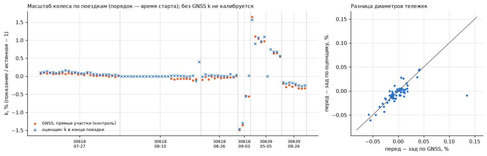
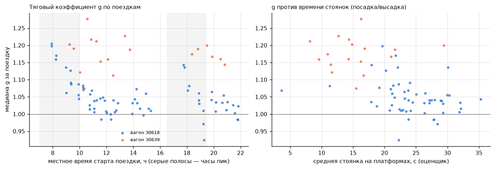
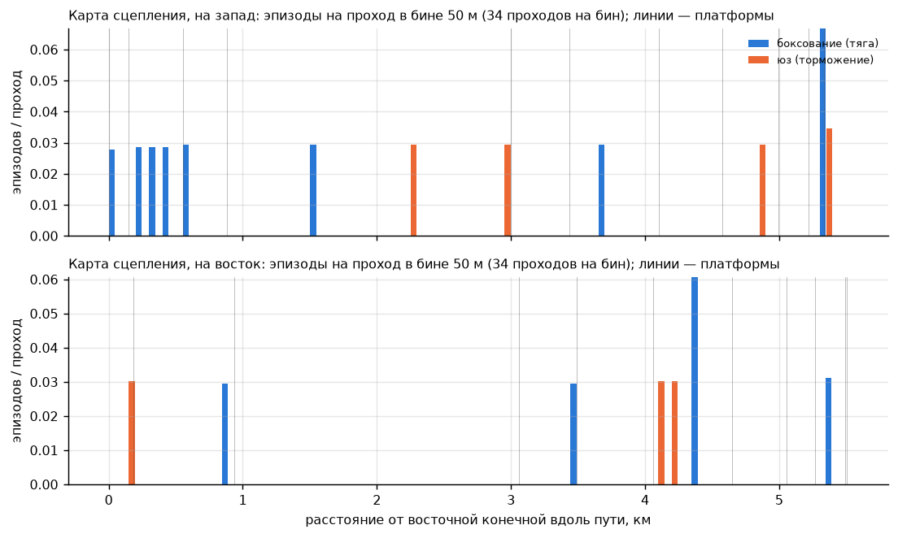
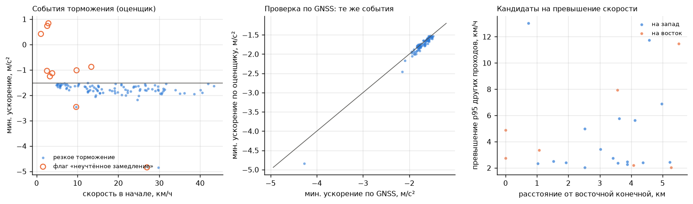
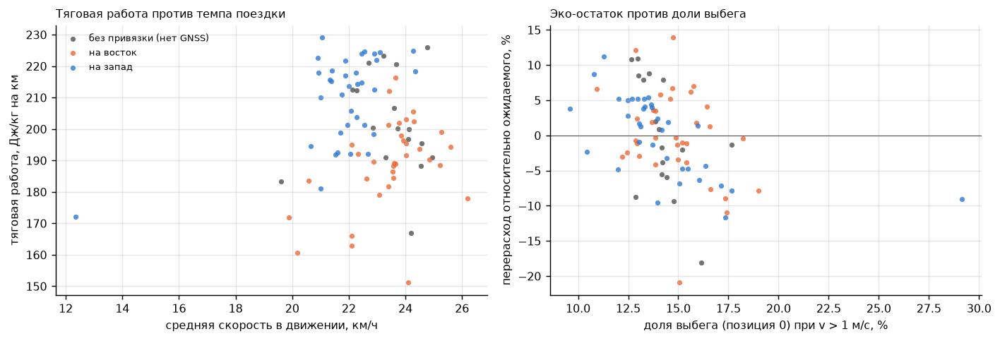
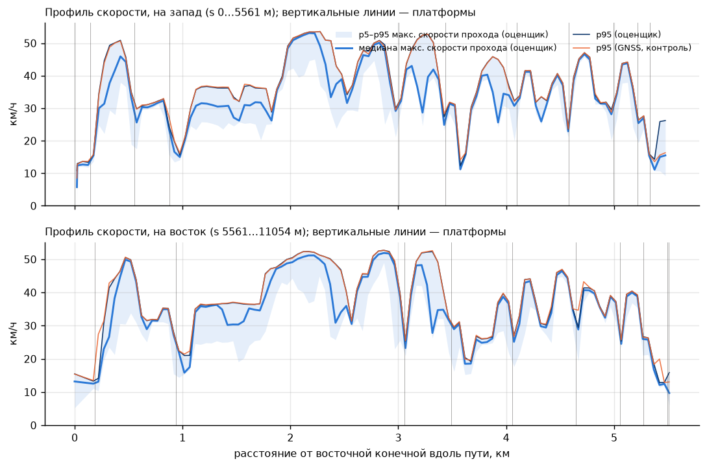

# Одна модель — много продуктов

> **Статус: черновик (26.09, работа остановлена по команде).**
> - Сделано: все шесть продуктов (а–е) посчитаны на 86 поездках оценщиком `tbo_replay_fix5.exe` с картами только по train. Цифры в тексте взяты из логов `analysis/products/out/p*.log`, рисунки лежат в `analysis/products/fig/`. Выгружена `analysis/products/adhesion_map.csv`.
> - Не сделано:
>   - финальная вычитка текста и повторный просмотр рисунков a, c, e, f после последних правок;
>   - старый кэш прогонов fix2 (`analysis/products/cache/fix2/`, 0,66 ГБ, в git не попадает) не удалён;
>   - ничего не закоммичено.
> - Следующие шаги:
>   - калибровка `g` по реальному сигналу загрузки;
>   - накопление данных для карты сцепления;
>   - таблица ограничений скорости для пункта (г);
>   - порог (< −2 м/с², > 5 км/ч) для флага экстренного торможения.

Резервная одометрия считает не только скорость и положение. Внутри фильтра есть величины, которые сами по себе несут эксплуатационную информацию: масштаб колеса `k`, тяговый коэффициент `g`, возмущение `d`, вероятности режимов IMM (норма, плохая передняя/задняя тележка, обе плохие, неучтённое ускорение), коэффициенты проскальзывания тележек, флаги диагностики, скорость и положение на карте. Этот документ проверяет, какие данные для депо и службы движения можно получить из этих состояний на реальных записях, и честно разделяет готовое и гипотезы.

Все цифры ниже получены скриптами из `analysis/products/`, их выводы лежат в `analysis/products/out/p*.log`.

## Как получены данные

- Оценщик: замороженная сборка `build_core/tbo_replay_fix5.exe`, по одному прогону на запись.
- Карты: только по обучающим записям (`analysis/validation_maps`: путь, ветки, остановочные ориентиры, места отсечки тяги, поле возмущения `dfield.csv`). Таблица тяги взята из пакета.
- GNSS подаётся в оценщик только в первые 5 с, как в тестовых записях жюри. Дальше GNSS используется только как независимый контроль продуктов и никогда не является их входом.
- Выборка: 86 уникальных длинных поездок (дубликаты и записи короче 5 минут исключены), всего 458 км.
  - По вагонам: 68 поездок вагона 30618 и 18 поездок вагона 30639.
  - 69 поездок начинаются с GNSS, поэтому оценщик привязывает их к карте, и для них доступны продукты «по месту».
  - 17 поездок без GNSS не привязаны к карте. Они участвуют только в продуктах уровня поездки.
- Место события — собственная дуговая координата оценщика `s_map` (антенна 1 на замкнутой карте длиной 11 053,6 м). Замкнутая петля сама разделяет направления: s от 0 до 5561 м — путь на запад, дальше — обратный путь на восток.
- На графиках по горизонтали отложено «расстояние от восточной конечной вдоль пути». Для восточного направления точки переносятся на ближайшую точку западного пути, поэтому поездки на восток читаются справа налево.

## Сводка

| Продукт | Состояние оценщика | Контроль по GNSS | Вердикт |
|---|---|---|---|
| а) Масштаб колеса | `k` в конце поездки; `slip_f − slip_r` | `k`: MAE 0,063 %, корреляция 0,984 (67 поездок) | **Надёжно** как контроль калибровки одометра и детектор сдвигов датчика. Износ — **гипотеза**: тренда за месяц нет, а суточные скачки до 1,1 % износом не являются |
| б) Загрузка вагона | `g` (медиана за поездку) | прямого эталона нет | **Гипотеза.** Знаки согласуются с нагрузкой, но есть сильные посторонние факторы |
| в) Карта сцепления | флаги боксования/юза, режим «только модель» | 61 % эпизодов подтверждается GNSS против 5 % в случайных окнах | Детектор **надёжен**, но карта пока **редкая**: 26 эпизодов на 458 км |
| г) События безопасности | скорость → ускорение; флаг неучтённого замедления | резкие торможения: точность 100 %, полнота 95 %, ошибка мин. ускорения 0,06 м/с² | Резкие торможения — **надёжно**. Флаг экстренного торможения требует дополнительного порога. Превышение относительно «p95 соседей» — **слабо**, по таблице ограничений — **надёжно** |
| д) Экодрайвинг | позиция контроллера + скорость + таблица тяги (+`g`) | на скорости GNSS прокси совпадает до 0,33 % (медиана) | Сравнение поездок между собой — **пригодно**. Абсолютные кВт·ч — **оценка** |
| е) Контроль скорости | скорость + `s_map` | максимум скорости прохода: MAE 0,35 км/ч; p95 по бину — медиана расхождения 0,12 км/ч | **Надёжно** |

---

## а) Износ и диаметр колёс: масштаб `k`

**Что считаем.** `k` — это отношение показания тележки к истинной скорости минус 1, в единицах оценщика: км/ч × 1,00037/3,6 с поправкой на кривые. Изношенное колесо меньше и крутится быстрее, поэтому завышает скорость: `k ≈ −ΔD/D`.

Оценщик уточняет `k` только на остановочных ориентирах и в местах отсечки тяги. По колёсам и модели `k` ненаблюдаем, поэтому фильтр держит его как «consider»-состояние. Значит, `k` калибруется только в поездках, привязанных к карте:
- медиана — 13 привязок к ориентирам за поездку, минимум 7;
- в 17 поездках без GNSS `k` остаётся равным априорному 0.

Эталон — медиана отношения «колесо / скорость GNSS» на прямых (|кривизна| < 0,002 1/м) при установившейся скорости выше 3 м/с, отдельно по каждой тележке.

Второй сигнал GNSS не требует совсем. Оценщик публикует остатки обеих тележек относительно одной и той же скорости вагона, и медиана `slip_f − slip_r` на прямых — это относительная разница диаметров передней и задней тележек.

**Результат** (скрипт `pa_wheel_scale.py`, лог `out/pa.log`, таблица `out/wheel_scale_runs.csv`, рисунок `fig/a_wheel_scale.png`):

- `k` в конце поездки против GNSS на 67 поездках:
  - медиана разности +0,046 %, MAE 0,063 %, RMS 0,096 %, корреляция 0,984;
  - если бы `k` оставался априорным (0), ошибка была бы MAE 0,243 % и RMS 0,449 %.
- Собственный эталон сходится с таблицей `k` из `DATA_FINDINGS`: корреляция 0,993. Сдвиг +0,048 % — это ожидаемый вклад кривых.
- Медианы по вагонам и дням (`k` оценщика / `k` по GNSS, %):

| Вагон | Дата | Поездок | `k` оценщика | `k` GNSS | Перед − зад, оценщик / GNSS |
|---|---|---|---|---|---|
| 30618 | 07-27 | 26 | +0,093 | +0,058 | −0,009 / −0,006 |
| 30618 | 08-10 | 10 | +0,012 | −0,072 | +0,003 / +0,006 |
| 30618 | 08-26 | 12 | +0,016 | −0,029 | 0,000 / −0,002 |
| 30618 | 09-03 | 4 | −0,929 | −0,959 | +0,036 / +0,039 |
| 30639 | 05-05 | 9 | +0,904 | +0,960 | −0,009 / −0,004 |
| 30639 | 08-26 | 8 | −0,205 | −0,295 | −0,029 / −0,028 |

- Внутри дня масштаб заметно дрейфует:
  - 30618, 3 сентября: по GNSS −1,49 % в 10:48 и −0,56 % в 19:18;
  - 30639, 5 мая: +1,64 % в 10:36 и +0,54 % в 20:48.
- Разница тележек (перед − зад) по оценщику совпадает с GNSS с MAE 0,009 % (корреляция 0,64 при очень малом разбросе). Во всех поездках она в пределах ±0,06 %. В 17 поездках без GNSS медиана +0,002 %, межквартильный размах −0,005…+0,006 %.



**Что это значит для ТО.** Точность 0,06 % соответствует примерно 0,4 мм на колесе диаметром 600 мм. Для отслеживания износа, допуск на который исчисляется единицами процентов диаметра, такой точности достаточно.

Однако в наших данных масштаб меняется не так, как при износе:
- за месяц у вагона 30618 (07-27 → 08-26) масштаб не растёт, а слегка падает (с +0,06 % до −0,03 % по GNSS);
- в отдельные дни он сдвигается на ±1–1,6 % и за несколько часов возвращается на 1 %.

Колесо так не изнашивается. Скорее всего, причина на стороне датчика или его обработки, что совпадает с выводом `DATA_FINDINGS` §8. Обе тележки при этом сдвигаются одинаково: разница между ними остаётся в пределах сотых процента.

Итог по пункту:
- **Готовый продукт** — ежедневный контроль калибровки одометра без GNSS (по ориентирам) и сигнал «масштаб колеса сдвинулся больше чем на 0,3 %».
- **Тренд износа** — гипотеза. Для его проверки нужны месяцы данных и журнал обточек колёсных пар.

## б) Загрузка вагона: тяговый коэффициент `g`

**Что считаем.** `g` умножает табличное ускорение привода a\*(позиция, скорость) — и тяговое, и тормозное: реализованное = `g` × табличное. Если бы сила привода при данной позиции не зависела от загрузки, то `g = m_ref/m`. Тогда каждая тонна груза снижала бы `g` примерно на 3,5 % при массе порожнего вагона 27,5 т.

Для каждой поездки берём медиану `g` в движении после 120 с прогрева: фильтр стартует с `g` = 1 и σ = 0,08, а дальше `g` меняется медленно.

Что проверяем:
- связь с тем, что должно зависеть от загрузки: время суток и среднее время стоянки на платформах (по оценщику; это косвенный показатель посадки и высадки);
- связь с тем, что от загрузки зависеть не должно: вагон, направление, `k`, `d`.

**Результат** (скрипт `pb_load_gain.py`, лог `out/pb.log`, рисунок `fig/b_load_gain.png`):

- Разброс `g` по 86 поездкам: медиана 1,051, межквартильный размах 1,016–1,133, диапазон 0,924–1,277. Внутри поездки p90 − p10 составляет 0,057.
- Если читать `g` как массу, межквартильный размах соответствует 3,3 т, а весь диапазон — 10 т. Это масштаб реальной пассажирской загрузки.
- Разница между вагонами:
  - медиана 1,039 у 30618 (68 поездок) и 1,181 у 30639 (18 поездок), тест Манна — Уитни p = 4·10⁻⁹;
  - у 30639 заметно короче стоянки: в основном 8–17 с против 18–35 с у 30618.
  - Это согласуется с тем, что 30639 — «лаборатория» (чаще пустая), а 30618 — линейный вагон с пассажирами. В массовом прочтении разница равна ≈ 4 т.
  - Однако тяговое оборудование двух вагонов тоже может отличаться, и отделить одно от другого по нашим данным нельзя.
- Вагон 30618 (корреляция Спирмена):

| Фактор | ρ | p |
|---|---|---|
| время суток | −0,49 | 2·10⁻⁵ |
| средняя стоянка | −0,36 | 0,008 |
| `k` | +0,19 | 0,11 |
| `d` | −0,13 | 0,31 |

- Регрессия `g ~ час + стоянка` для 30618 (52 поездки): −0,0054 за час (t = −4,1) и −0,032 за каждые 10 с стоянки (t = −2,9). Эффект стоянки сохраняется и при учёте времени суток. Это самый сильный довод за прочтение «`g` ≈ загрузка»: около 0,9 т на 10 с стоянки.
- У 30639 (18 поездок) значимых связей нет.
- Разница по направлениям слабая: запад 1,040, восток 1,060 (p = 0,06).
- Против простой гипотезы говорит время суток. «Час пик» у 30618 даёт `g` выше, а не ниже: 1,084 против 1,029, p = 6·10⁻⁵. Причина — ранние утренние поездки (8–9 ч) с `g` ≈ 1,15–1,20. Дальше `g` монотонно падает в течение дня, как и масштаб `k` в дни с дрейфом. Механизм этого суточного тренда неизвестен: возможны температура привода, сцепление, стиль вождения или первые рейсы из депо.



**Вердикт: гипотеза, сейчас не продукт.** Признаки согласуются с загрузкой (разница вагонов, связь со стоянками), но есть посторонние факторы (оборудование вагона, неизвестный суточный тренд, модель уклонов, стиль вождения), а эталона нет. Чтобы превратить это в продукт, достаточно откалибровать `g` на нескольких сотнях поездок по реальному сигналу загрузки:
- датчику давления пневмоподвески (load-weighing), если он есть в CAN;
- или данным АСКП / валидаторов.

## в) Карта сцепления: где колёса боксуют и идут юзом

**Что считаем.** Используются два уровня эпизодов, оба из выхода оценщика:
- **Флаги:** боксование или юз тележки (тележка в «плохом» режиме IMM и показывает больше или меньше скорости вагона) и режим «только модель» (обе тележки под подозрением). Флаги ближе 2 с друг к другу сливаются в один эпизод.
- **Микро-эпизоды:** расхождение тележек больше 0,3 м/с и больше 4 % скорости при v > 2 м/с в течение не менее 0,3 с, которое фильтр поглотил без флага.

Первые 5 с записи и выпадения датчиков исключены. Эпизод привязывается к месту виновной тележки: передняя на 9,9 м, задняя на 2,35 м впереди антенны 1. Частота считается на один проход бина 50 м.

Контроль по GNSS: внутри настоящего эпизода виновная тележка должна расходиться с путевой скоростью, то есть должна быть велика величина max |колесо − (1 + k) v_GNSS|.

**Результат** (скрипт `pc_adhesion_map.py`, лог `out/pc.log`, события `out/adhesion_events.csv`, горячие точки `out/adhesion_hotspots.csv`, рисунок `fig/c_adhesion_map.png`):

- 26 эпизодов по флагам на 458 км (5,7 на 100 км) в 19 из 86 поездок. Медианная длительность 1,7 с.
  - Состав: 16 боксований, все под тягой; 10 юзов, из них 9 под тормозными позициями; в 8 эпизодах был режим «только модель».
  - Тележки: передняя 10, задняя 8, обе 8.
  - 31 % эпизодов пришёлся на кривые с |кривизной| > 0,01 1/м (R < 100 м).
- Микро-эпизодов 13, и все они уже покрыты флагами. Фильтр не пропускает заметных расхождений тележек.
- Контроль по GNSS: в 61 % эпизодов (14 из 23 привязанных к GNSS) колесо расходится с путевой скоростью больше чем на 0,3 м/с, а в случайных окнах той же длины — лишь в 5,2 % (115 окон). Медианы 0,77 и 0,061 м/с.
  - Неподтверждённые эпизоды — в основном трогания с 0–4 км/ч. Там абсолютное расхождение мало, а скорость по GNSS шумит.
- Вагон 30639 даёт 16 эпизодов на 18 поездок, вагон 30618 — 10 на 68.
- Эпизоды есть в 19 бинах из 220. Только два бина повторяются в двух разных поездках:
  - s 5300–5350 м (запад, 5,33 км от восточной конечной, в 10 м от платформы, уклон −1,4 %, кривая R ≈ 48 м): два боксования передней тележки при трогании с 4 км/ч;
  - s 6750–6800 м (восток, 4,37 км): два боксования передней тележки при трогании с места, в 280 м от ближайшей платформы.



**Таблица для фильтра** — `analysis/products/adhesion_map.csv`, по бину 50 м на всю петлю (222 строки). Координата s — дуга главной петли. В пакетной карте (все данные) та же параметризация: длины 11 053,16 и 11 053,15 м. Колонки:
- `s_start`, `s_end`, `passes` — число поездок, прошедших бин;
- `slip_episodes`, `slide_episodes` — эпизоды без двойного счёта флагов и микро-эпизодов;
- `rate_per_pass` = (slip + slide) / passes;
- дополнительно `flag_episodes`, `model_only_episodes`, `micro_episodes`, `runs_with_episode`.

Ненулевая частота есть в 19 бинах. Как априорную вероятность её стоит сглаживать, например (эпизоды + α)/(проходы + β): при 34 проходах на бин один эпизод даёт 0,03 и почти ничего не говорит.

**Вердикт.** Детектор надёжен: подтверждается путевой скоростью в 12 раз чаще случайного и не пропускает расхождений тележек. Но карта на наших 458 км **пока редкая**: в данных просто мало случаев плохого сцепления.

Для продукта нужен поток данных. При 5,7 эпизода на 100 км вагон с пробегом 200 км в сутки даёт около 11 эпизодов в день, а за месяц — около 340, то есть в среднем 1,5 на бин. Горячие точки проявятся за 1–2 месяца на одном вагоне или за несколько дней на парке.

## г) События безопасности

**Что считаем.**
1. **Резкие торможения:** ускорение ниже −1,5 м/с² не менее 0,3 с. Ускорение — центральная разность оценённой скорости на окне 1 с. То же правило, применённое к скорости GNSS, служит контролем.
2. **Флаг «неучтённое замедление»:** колёса согласованно показывают замедление, которое позиция контроллера не объясняет (режим IMM «манёвр» > 0,5). Так выглядит экстренный или рельсовый тормоз.
3. **Кандидаты на превышение скорости:** официальной таблицы ограничений нет, поэтому эталон — p95 максимальной скорости других проходов того же бина 50 м. Кандидат — проход быстрее этого p95 больше чем на 2 км/ч. Соседние бины одной поездки считаются одним событием.

**Результат** (скрипт `pd_safety_events.py`, лог `out/pd.log`, таблицы `out/safety_*.csv`, рисунок `fig/d_safety_events.png`):

- **Резкие торможения:** 100 событий (21,8 на 100 км) в 60 из 86 поездок. Медиана начальной скорости 18 км/ч, медиана минимального ускорения −1,74 м/с², минимум −4,84 м/с².
  - 91 событие — служебное торможение позициями −8…−15.
  - В 9 событиях контроллер торможения не задавал (позиция 0 или −1). Это отдельный интересный класс «торможение не от контроллера».
- **Контроль по GNSS** на 69 поездках: оценщик нашёл 80 событий, GNSS — 74.
  - Точность: у всех 80 событий оценщика GNSS в пределах ±1,5 с показывает ускорение ниже −1,2 м/с².
  - Полнота: 95 %. Из 4 пропусков три — одиночные всплески GNSS до −3…−6 м/с², которых нет в скорости оценщика, то есть скорее артефакты GNSS; четвёртый — на пороге (−1,61 против −1,58).
  - Минимальное ускорение оценщика отличается от GNSS на −0,03 м/с² по медиане, MAE 0,06 м/с².
- **Флаг неучтённого замедления:** 10 эпизодов в 10 поездках.
  - Два — настоящие экстренные торможения при позиции 0…+2:
    - −4,84 м/с² с 27 км/ч (по GNSS −4,27), поездка 30618_616ec56b;
    - −2,46 м/с² с 10 км/ч (по GNSS −2,16), 30618_88548b02.
  - Остальные восемь — короткие (0,07–0,5 с) эпизоды на 1–13 км/ч без сильного замедления.
  - Вывод: для отчёта о безопасности флаг нужно дополнить порогом (ускорение < −2 м/с² и скорость > 5 км/ч). Внутри фильтра флаг работает как задумано: не даёт принять торможение за юз.
- **Превышение относительно «p95 соседей»:** 24 события в 14 из 69 поездок, превышение по медиане 2,7 км/ч, максимум 13 км/ч. 10 событий приходятся на одну поездку (30618_27e994fc, 3 сентября, 19:17, самая длинная запись).
  - Совпадение с тем же правилом по GNSS низкое: GNSS подтверждает 43 % флагов оценщика, а оценщик находит 31 % флагов GNSS.
  - Причина — пороговый эффект. Превышения лежат около 2 км/ч, а максимум прохода по двум источникам расходится в среднем на 0,35 км/ч. Кроме того, у GNSS есть свои всплески.
- **Превышение фиксированного ограничения** — так работал бы продукт с настоящей таблицей ограничений:
  - порог 50 км/ч: оценщик и GNSS расходятся в 23 проходах из 6907 (0,3 %), и все они в пределах 1 км/ч от порога;
  - порог 40 км/ч: 57 расхождений (0,8 %), из них 46 в пределах 1 км/ч от порога.



**Вердикт.**
- Журнал резких торможений — **готовый продукт**: точность и полнота на уровне GNSS, есть место, скорость и позиция контроллера.
- «Торможение без тормозной позиции» — полезный отдельный сигнал: 9 случаев, из них 2 экстренных.
- Контроль превышений **готов при наличии таблицы ограничений** по километражу. Правило «быстрее соседей» годится только как подсказка для разбора.

## д) Экодрайвинг

**Что считаем.** Тяговая работа на единицу массы (Дж/кг) — это сумма по тяговым позициям величины (a\*(n, v) − a\*(0, v)) · v · dt:
- a\* — пакетная таблица ускорений привода на ровном пути, куда уже включено сопротивление движению, поэтому a\*(0, v) — замедление на выбеге;
- v — скорость оценщика.

Тормозная работа считается так же по тормозным позициям. `g` в основной прокси не входит: если сила при данной позиции не зависит от загрузки, энергия (сила × путь) от неё тоже не зависит. Вариант с `g` приведён для сравнения. Доля выбега — время на позиции 0 от времени при v > 1 м/с.

Поездки различаются в первую очередь темпом и числом остановок. Поэтому показатель экодрайвинга — это остаток тяговой работы на км после регрессии на среднюю скорость в движении, число остановок на км и направление.

**Результат** (скрипт `pe_ecodriving.py`, лог `out/pe.log`, таблица `out/eco_runs.csv`, рисунок `fig/e_ecodriving.png`):

- Тяговая работа: медиана 200 Дж/кг на км (межквартильный размах 190–215, диапазон 151–229). Отношение p90/p10 — 1,23.
  - Для порожнего вагона 27,5 т это ≈ 1,5 кВт·ч/км на ободе колеса.
- Доли времени при v > 1 м/с: выбег 14,1 % (межквартильный размах 13,0–15,3 %), тяга 45,8 %, торможение 39,9 %.
- Регрессия на темп, остановки и направление объясняет R² = 0,42 разброса:
  - +4,8 Дж/кг·км на каждый км/ч средней скорости;
  - на восток на 27,7 меньше, чем на запад.
- Остаток (перерасход против ожидаемого) имеет стандартное отклонение 6,5 %. Он связан с долей выбега (корреляция −0,45): при одном и том же темпе больше выбега — меньше работы. Это ожидаемый знак.
- Лучшие поездки тратят на 10–21 % меньше ожидаемого, худшие — на 11–14 % больше.
- Если бы все поездки выше лучшей четверти по остатку дотянули до неё, тяговая работа снизилась бы на 5,2 %. Это оценка потенциала, а не измерение.
- Медианы остатка по вагону и дню:

| Вагон | Дата | Остаток |
|---|---|---|
| 30618 | 07-27 | +2,9 % |
| 30618 | 08-10 | +0,3 % |
| 30618 | 08-26 | +0,8 % |
| 30618 | 09-03 | +1,2 % |
| 30639 | 05-05 | −7,4 % |
| 30639 | 08-26 | −4,3 % |

  У 30639 выбега больше (17 % против 13–14 %). Однако вагон и водитель здесь неразделимы: идентификатора водителя в данных нет.
- Контроль: та же прокси на скорости GNSS отличается на 0,33 % по медиане. У трёх поездок 30639 расхождение 11–21 %, но у них на столько же расходится и пройденный путь: это пропуски сообщений скорости GNSS, а не ошибка оценщика.
- Вариант с `g` коррелирует с основным с r = 0,89. Простое «позиция × время» — с r = 0,72.



**Вердикт.**
- **Сравнение поездок между собой пригодно:** одинаковая база, остаток после поправки на темп, осмысленная связь с выбегом.
- **Абсолютные кВт·ч — оценка.** Энергетический баланс прокси не замыкается: тормозная работа составляет 1,11 от тяговой, хотя должна быть меньше. Таблица тяги подобрана для прогноза скорости, а не для учёта энергии, и в ней есть шум (например, a\*(0, 6 м/с) > 0).
- Для рейтинга водителей нужен табельный номер или привязка к наряду. Для абсолютной энергии нужен счётчик тяговой подстанции или бортовой счётчик.

## е) Контроль скорости: профиль по месту

**Что считаем.** Для каждого прохода (поездка × бин 50 м) берём максимальную и среднюю скорость, для каждого бина — медиану и p95 по проходам. Направление определяется петлёй. Тот же профиль строится по GNSS (координата и скорость master-антенны за всю поездку).

**Результат** (скрипт `pf_speed_profile.py`, лог `out/pf.log`, таблицы `out/speed_profile.csv` и `out/speed_passes.csv`, рисунок `fig/f_speed_profile.png`):

- 69 поездок, 7555 проходов, 220 бинов. Медиана — 34 прохода на бин в каждом направлении.
- Максимум скорости прохода по оценщику против GNSS: медиана +0,01 км/ч, MAE 0,35 км/ч, p95 модуля 1,0 км/ч (6907 проходов).
- p95 по бину: медиана расхождения 0,12 км/ч. Три бина из 220 расходятся на 10–13 км/ч. Все три — в конечных петлях (0,2 км на востоке и 5,43–5,48 км на западе), где пути сходятся и фиксы GNSS проецируются на соседний путь.
- Самый быстрый участок: 2,1–2,3 км от восточной конечной на запад, p95 53,6 км/ч; на восток — 2,8–2,9 км, p95 52,7 км/ч. Медиана максимума прохода по всем бинам — 31,8 км/ч на запад и 35,2 км/ч на восток.
- Медленные зоны (p95 < 20 км/ч, не остановка):
  - обе конечные петли;
  - 0,93–0,98 км на запад: прямая на спуске 1,2–1,6 %, похоже на постоянное ограничение;
  - 3,58–3,67 км в обоих направлениях: кривые с R ≈ 23–48 м.



**Вердикт: надёжно.** Профиль, построенный только по оценщику, совпадает с GNSS в пределах десятых долей км/ч везде, кроме конечных петель. Его можно:
- сверить с приказом об ограничениях скорости;
- использовать как «фактическое ограничение» там, где приказа нет (p95 или p85 прохода, как в дорожной практике);
- кормить им пункт г) — контроль превышений.

---

## Как воспроизвести

```
python analysis/products/run_replays.py        # 86 прогонов fix5 → analysis/products/cache (≈30–50 мин, 2 параллельно)
python analysis/products/pf_speed_profile.py   # (е) — первым: его таблица проходов нужна для (г)
python analysis/products/pa_wheel_scale.py     # (а)
python analysis/products/pb_load_gain.py       # (б)
python analysis/products/pc_adhesion_map.py    # (в) → analysis/products/adhesion_map.csv
python analysis/products/pd_safety_events.py   # (г)
python analysis/products/pe_ecodriving.py      # (д)
```

- Кэш (`analysis/products/cache/`, около 0,7 ГБ) в git не попадает: он закрыт правилом `**/cache/`.
- Общие функции — в `analysis/products/common.py`: запуск оценщика, карта, привязка GNSS-эталона, биты флагов из `core/include/tbo/types.hpp`.

## Файлы

- Скрипты: `analysis/products/common.py`, `run_replays.py`, `pa_wheel_scale.py`, `pb_load_gain.py`, `pc_adhesion_map.py`, `pd_safety_events.py`, `pe_ecodriving.py`, `pf_speed_profile.py`.
- Рисунки: `analysis/products/fig/a_wheel_scale.png`, `b_load_gain.png`, `c_adhesion_map.png`, `d_safety_events.png`, `e_ecodriving.png`, `f_speed_profile.png`.
- Таблицы и логи с цифрами: `analysis/products/out/` (`runs.csv`, `wheel_scale_runs.csv`, `load_gain_runs.csv`, `adhesion_events.csv`, `adhesion_hotspots.csv`, `safety_*.csv`, `eco_runs.csv`, `speed_profile.csv`, `speed_passes.csv`, `p*.log`).
- Априорная карта сцепления для фильтра: `analysis/products/adhesion_map.csv`.
