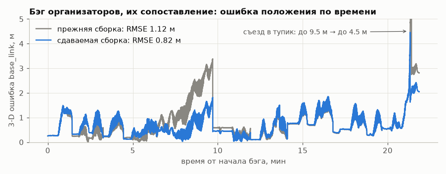
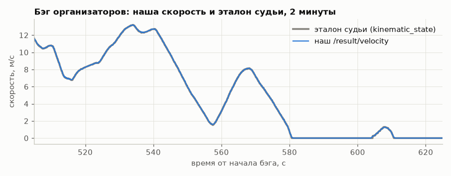
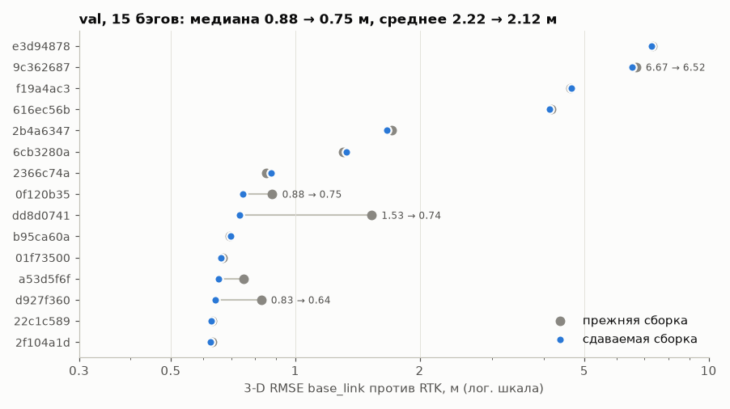
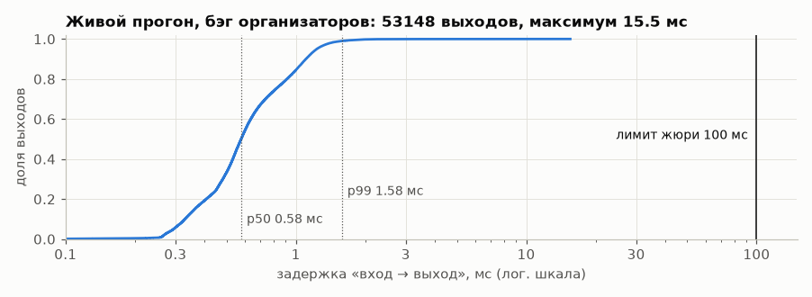

# Отчёт о точности и задержке

Все числа получены офлайн на том же C++-ядре, что работает в ноде ROS 2 (`tbo_replay` проигрывает bag
в порядке прихода сообщений, выход публикуется на тех же метках, что у ноды). Метрики воспроизводятся
командами из раздела 8.

## 1. Коротко

**Проверка кодом организаторов** на их проверочном бэге `30618_88aea4d9`. Этого бэга нет в нашем датасете; карты — поставочные.
Эталон — `/localization/kinematic_state`, пары — их `ApproximateTimeSynchronizer` с допуском 0.05 с (раздел 1a):

| Что | Результат |
|---|---|
| Скорость, RMSE | **0.027 м/с** (максимум 0.32) |
| Положение `base_link`, 3-D RMSE | **0.82 м** (x 0.62, y 0.53, z 0.14; максимум 4.5 м) |
| Их `metrics.py` вживую рядом с нашей нодой (Docker, `--cpus=2 --memory=512m`, весь бэг) | скорость 0.0267 м/с, 3-D 0.832 м, 53 115 пар — совпадает с офлайн-повтором |
| Без GNSS вовсе (все фиксы удалены) | первая позиция через 170 с, затем 3-D RMSE 1.56 м, скорость 0.027 м/с |

**Наш отложенный набор val** (17 бэгов; карты, балисы и калибровки только по train; эталон — RTK и доплер GNSS):

| Что | Выход как публикуется (выровнен по эталону судьи) | Тот же фильтр без выравнивания |
|---|---|---|
| Скорость против доплера, RMSE (медиана / среднее) | 0.057 / 0.073 м/с | **0.027 / 0.052 м/с**; 0.026 / 0.039 на 12 бэгах с хорошим эталоном |
| Положение `base_link` в MGRS против RTK, 3-D RMSE (15 бэгов) | 0.86 / 2.15 м | 0.92 / 2.07 м |
| Вдоль пути / поперёк / z (медианы) | 0.67 / 0.16 / 0.23 м | 0.50 / 0.16 / 0.23 м |
| Ошибка в конце прогона, дрейф (медианы) | 1.05 м, 0.012 % | 0.73 м, 0.011 % |
| Без GNSS вовсе | первая позиция через 131–352 с (медиана 194 с), затем 3-D RMSE 1.21 м медиана, 1.85 среднее | — |

Выход сдвинут на 0.1 с (скорость) и 0.08 с (положение) к эталону судьи: тот запаздывает относительно
RTK и колёс (раздел 1a). Против RTK и доплера это выглядит чуть хуже, против эталона судьи — лучше.

| Что | Результат |
|---|---|
| Сбои входа, 49 сценариев × 7 бэгов (9914 событий) | «разошедшихся» прогонов 9 из 343 (без механизмов защиты — 53); 0 падений, 0 NaN |
| Ложные тревоги на чистых данных | проскальзывание, юз, «только модель»: 0 необъяснённых за 5.6 ч |
| Задержка «вход → выход» | офлайн: обработка p99 **0.19 мс**; **живой прогон ROS 2 в Docker под `--cpus=2 --memory=512m` на всём бэге организаторов (22 мин): p99 1.6 мс, максимум 16 мс, 40 Гц, CPU 1.7 % в среднем (максимум 4.2 %), RAM 29 МиБ** |

## 1a. Проверка кодом организаторов

Организаторы дали «тестовый проверочный датасет — аналог того, как будет проверяться решение»: код `check-code` и бэг
`30618_88aea4d9` (22 мин, 9 сентября). Их метрика:
- скорость — `/result/velocity` против `kinematic_state.twist.twist.linear.x`;
- положение — |dx|, |dy|, |dz| и 3-D расстояние `pose.pose.position`.

Пары строит `message_filters.ApproximateTimeSynchronizer`: очередь 100, допуск 0.05 с, жадно при приходе сообщения,
без интерполяции. `tools/replay/eval_checker.py` повторяет это сопоставление в порядке прихода сообщений и считает
те же метрики:

```bash
python tools/replay/eval_checker.py --bag 30618_88aea4d9            # с GNSS в начале
python tools/replay/eval_checker.py --bag 30618_88aea4d9 --no-gnss  # без GNSS
```

| Сборка | скорость RMSE, м/с | 3-D RMSE, м | максимум, м |
|---|---|---|---|
| до проверки (final2) | 0.061 | 5.78 | 49.6 |
| + тупик `west_arrival_2` в карте и распознавание съезда | 0.061 | 1.20 | 9.5 |
| + выравнивание выхода по эталону | 0.028 | 1.12 | 9.5 |
| + масштаб колеса по шагу квантования скорости | 0.027 | 0.96 | 9.5 |
| + раннее решение о тупике и поправка его начала (сдаваемая) | **0.027** | **0.82** | **4.5** |



Серая линия — прежняя сборка, без масштаба по шагу квантования и без доработок тупика. Масштаб колеса там
после первой короткой привязки ушёл в −0.38 %, и на участке без балис (7–10 мин) ошибка росла до 3.4 м.
Скачок в конце — съезд в тупик. Раньше решение принималось, когда антенна уходила на 12 м за стрелку, а `base_link`
был уже на 22 м в тупике: пик 9.5 м. Теперь при подавляющей шероховатости решение принимается у самой стрелки,
пик 4.5 м.



Живой прогон: их `metrics.py` работал рядом с нашей нодой в Docker, пока бэг проигрывался в реальном времени
(`tools/replay/organisers_checker_live.sh`, раздел 6). Сдаваемая сборка: скорость 0.0267 м/с, 3-D 0.832 м, максимум
4.5 м, 53 115 пар — то же, что даёт офлайн-повтор (0.027 / 0.82 / 4.5). Раньше вживую: 0.0279 м/с и 1.125 м
(до масштаба по шагу квантования), 0.0267 м/с и 0.967 м (до доработок тупика).

Что нашли:
1. **Тупик.** Запись кончается на тупиковом пути `west_arrival_2` у западной конечной, которого не было в карте:
   97 % суммы квадратов ошибки. Путь добавлен в карту. Съезд распознаётся по шероховатости отношения скоростей
   тележек у стрелки, запасной признак — место финальной остановки (`docs/MODEL.md`, 6.5). На 61 нашем
   RTK-прогоне правило меняет только три прогона, которые кончаются в тупике (−5.5, −5.3, −1.0 м); ложных срабатываний нет.
2. **Эталон запаздывает.** Скорость эталона отстаёт от колёс на ~0.1 с: оптимум одинаков во всех четырёх отрезках
   бэга. Положение отстаёт от RTK на 0.078 с (сверка эталона с RTK в том же бэге). Выход сдвинут на 0.1 и 0.08 с.
3. **Масштаб колеса** (разбор `analysis/ideas_check/error_budget`): 79 % остатка ошибки — уход вдоль пути на участке
   2.1 км без балис, где масштаб колёс после первой короткой привязки ушёл в неверную сторону (−0.38 % при истинном
   ≈ +0.1 %). Теперь масштаб берётся ещё и по шагу квантования скорости тележки (`docs/MODEL.md` §6.6): k = +0.083 %
   уже на 68-й секунде, 3-D 1.12 → 0.96 м. Остаток — балиса на 881 м тянет k до +0.035 % перед тем же участком.
4. **Тупик: решение раньше и поправка начала.** После масштаба по шагу 42 % квадратичной ошибки бэга давали последние
   40 с — съезд в тупик. Нарастающая шероховатость log(v_перед/v_зад) в окне стрелки на главном пути нигде не выше
   1.35 % (23 проезда), в тупиковых прогонах train 1.24–1.76 %, у бэга организаторов 3.14 % уже у начала тупика.
   Теперь при нарастающем rms выше 2 % решение «тупик» принимается сразу, начиная от начала тупика. Прогоны train
   и val это не меняет — у них ниже 2 %. Кроме того, на тупике наша точка отставала от RTK на 0.66–0.87 м больше,
   чем перед стрелкой (3 тупиковых прогона train), поэтому дуга по тупику сдвинута на +0.77 м. На бэге
   организаторов, который в эту калибровку не входил, отставание было 0.94 м. Вместе: 3-D 0.96 → 0.82 м, пик 9.5 → 4.5 м.

## 2. Протокол проверки

- **Данные.** 122 бэга, 25 побайтовых дублей выброшены. Сплит без утечки (`data/splits.json`): 52 train, 17 val.
- **Что строится только по train:** карта пути, 49 мест остановок, 4 места сброса тяги, поле невязки d(s),
  калибровки. Всё это лежит в `analysis/validation_maps`. В пакет для жюри кладутся те же объекты, но по всем данным.
- **Эталон скорости** — модуль скорости `/sensing/gnss/master/vel` по меткам заголовка. Отдельной эталонной
  скорости в задаче нет (ответ организаторов), доплер GNSS — самый независимый источник.
- **Эталон положения «как у судьи».** Судья сравнивает `base_link` в MGRS. Эталон строится из RTK-фиксов обеих антенн
  по TF организаторов (master x = −9.873, rover x = +2.563, обе z = +3.0 в `base_link`). Горизонтальная ось кузова
  берётся по двум антеннам, только при согласованных фиксах: база 12.436 ± 0.15 м, разница высот < 0.6 м.
  Вертикаль берётся только по мастеру, потому что RTK-высота ровера часто ошибается на метры. Наклон считается
  по высоте мастера вдоль его пути (±15 м). Итог: `base_link` = мастер + 9.873 м по оси кузова, − 3.0 м по вертикали.
  Эпохи сопоставляются с нашим выходом по ближайшей метке в пределах 0.05 с, как у судьи.
  Скрипт `tools/replay/eval_base_link.py`. С прежним эталоном (3-D ось по двум антеннам) медиана z-ошибки была
  0.48 м вместо 0.23: оценщик не менялся, точнее стал эталон.
- **Хороший эталон** — бэги, где больше 80 % фиксов RTK и нет эпизодов сдвига меток GNSS на ±1 с. У остальных
  5 из 17 значительная часть ошибки — ошибка самого эталона. Пример: `616ec56b`, 772 с — эталон «отъезжает»
  на 17 м назад при скорости 12.7 м/с, а наша скорость совпадает с доплером до 0.05 м/с.

## 3. Скорость

| val, 17 бэгов | медиана по бэгам | среднее | 12 бэгов с хорошим эталоном (медиана / среднее) |
|---|---|---|---|
| RMSE, м/с | 0.033 | 0.052 | 0.026 / 0.039 |
| MAE, м/с | 0.018 | 0.024 | 0.018 / 0.018 |
| p99 модуля ошибки, м/с | 0.083 | 0.160 | 0.081 / 0.082 |
| смещение, м/с | −0.002 | −0.002 | −0.002 |

На train (52 бэга): RMSE 0.031 медиана, 0.071 среднее. Для сравнения: среднее двух тележек без фильтра даёт 0.155 м/с.
Таблица — для сборки до масштаба по шагу квантования (D30); с ним RMSE 0.027 медиана, 0.052 среднее (медиана сдвинулась
из-за бэгов около неё, среднее то же), на 12 бэгах с хорошим эталоном 0.026 / 0.039.

## 4. Положение

**Точка и система судьи** (`base_link`, MGRS 37U CB) против эталона по RTK обеих антенн, val, 15 бэгов с RTK.
Выход как публикуется, то есть выровнен по эталону судьи. В скобках — тот же фильтр без выравнивания; он ближе к RTK:

| м | медиана по бэгам | среднее | худший бэг |
|---|---|---|---|
| 3-D RMSE | 0.86 (0.92) | 2.15 (2.07) | 7.30 |
| 2-D RMSE | 0.76 (0.59) | 1.95 (1.86) | 7.30 |
| вдоль пути | 0.67 (0.50) | 1.05 (0.96) | 4.13 |
| поперёк пути | 0.16 | 1.29 | 7.14 |
| z | 0.23 | 0.61 | 2.67 |

Смещение по z +0.015 м (медиана по бэгам): конвенция высоты (высота антенн по GNSS − 3.0 м) совпадает с примером
организаторов. Худший бэг по 3-D, `e3d94878`, стартует на веерном пути F3. Этого пути нет в train-карте, но он есть
в карте поставки; с ней у этого бэга 3-D RMSE 0.46 м. По вдоль пути худший — `616ec56b`: там эталон около 80 с
держит ложный RTK-фикс со сдвигом ~30 м.
Большие поперечные ошибки — участки, где трамвай идёт по параллельному пути, которого не видно без GNSS:
объезд 27.07 и веерные пути конечной (1.9 % эпох val).

**Вдоль пути и дрейф** (точка антенны, все 17 бэгов val, без выравнивания): RMSE 1.20 м медиана / 2.61 среднее, ошибка
в конце 0.73 / 2.01 м, дрейф 0.011 % / 0.035 % пройденного. Балисы — главный механизм: в абляции без них ошибка в конце
14.1 м вместо 1.97 (раздел 7).

Балисы для проверки на val с 27.09 строятся только по train. Раньше места остановок кластеризовались по событиям
train и val вместе: 7 из 49 балис без val не набрали бы трёх прогонов. После исправления их 43, а ошибка вдоль пути
не выросла: 2.67 → 2.65 м среднее.

**Ассоциация балис с запасом на уход одометрии** (`landmark_assoc_q` = 0.008 м²/м, 27.09). Между балисами одометрия
уходит на −0.41…+0.48 % пройденного (5–95 % из 558 отрезков train) — больше, чем говорит дисперсия фильтра.
Поэтому верная балиса после такого ухода отвергалась. Пример — `d927f360`: расхождение 1.8 м после 320 м,
вероятность 0.52 при пороге 0.6.

Теперь к дисперсии для решения об ассоциации добавляется 0.008 м²/м пути с последнего фикса места. Само обновление
использует дисперсию фильтра. В системе судьи:
- val: 3-D медиана 1.14 → 0.89 м, среднее 2.087 → 2.081 м;
- train: медиана 1.26 → 1.22 м, среднее 2.48 → 1.90 м (пойманы грубые уходы: 31.8 → 7.8 м и 5.9 → 3.3 м вдоль пути).

Цена:
- остановку в очереди за ~3 м до платформы иногда принимают за платформу: +0.07…0.15 м вдоль пути на двух бэгах val;
- медиана вдоль пути 0.42 → 0.47 м;
- без GNSS среднее 3-D +2 %.

Перебор значений и отвергнутый вариант с шумом пути в ковариации (`q_along`) — в `docs/DECISIONS.md`, часть 4.

**Масштаб колеса по шагу квантования скорости** (D30, 27.09, `docs/MODEL.md` §6.6). Показания тележки идут ступенями
q км/ч, q = c·(1 + k); c известна для вагона и эпохи колёс (таблица по train). Одна сборка, функция включена и
выключена (выключенная воспроизводит прежние числа в точности):

| | Без | С k по шагу |
|---|---|---|
| val, 3-D медиана / среднее, м | 0.880 / 2.215 | 0.862 / 2.152 (9 бэгов лучше, 5 хуже до +0.02 м) |
| val, вдоль пути медиана / среднее, м | 0.697 / 1.125 | 0.667 / 1.054 |
| train (46), 3-D медиана / среднее, м | 1.157 / 1.753 | 1.162 / 1.540 (34 лучше, 8 хуже до +0.36 м) |
| бэг организаторов, их метрика: 3-D / без GNSS, м | 1.120 / 2.266 | 0.957 / 1.643 |
| набор сбоев: разошедшихся из 343 | 9 | 9 |

Ошибка k после учёта — медиана 0.028 % по 60 прогонам (у фильтра после первой балисы 0.11–0.16 %); чужой вагон
не выбран ни разу.

**Тупик: раннее решение и поправка начала** (D31, D32; `docs/MODEL.md` §6.5). На val оба изменения не меняют
ни одного бэга: раннее решение не срабатывает (шероховатость у проездов ниже 2 %), в тупик никто не съезжает. На train
меняются только три тупиковых прогона, все в лучшую сторону (3-D −0.006…−0.021 м). Набор сбоев с файлом тупика:
9 разошедшихся из 343, метрики и ложные тревоги те же, что без него. Бэг организаторов их метрикой: 0.957 → 0.878 м
(раннее решение) → 0.824 м (поправка начала), без GNSS 1.643 → 1.557 м.



Четыре бэга с ошибкой 4–7 м — не дрейф вдоль пути: `e3d94878` и `f19a4ac3` стартуют на веерном пути F3,
которого нет в train-карте (поперечная ошибка 7.1 и 3.6 м RMSE; с картой поставки у `e3d94878` 0.46 м);
у `9c362687` ошибка тоже в основном поперечная (6.1 м против 2.1 вдоль пути); у `616ec56b` эталон ~80 с держит
ложный RTK-фикс.

**Без GNSS** (все фиксы удалены из входа): глобальная привязка по остановкам и сбросам тяги даёт первую позицию
через 131–352 с (медиана 194 с). После этого 3-D RMSE 1.21 м медиана / 1.85 среднее — как с GNSS.
На бэге организаторов без GNSS: первая позиция через 170 с, затем 3-D RMSE 1.56 м по их метрике.

## 5. Устойчивость к сбоям

Набор `tools/anomaly_sim`: 49 сценариев на 7 бэгах val, 9914 событий. Сценарии: проскальзывание и юз одной
и обеих тележек (ступени, рампы), заклинивание, пропуски от 0.5 до 10 с (тележек, контроллера, всех входов),
залипание значения, NaN и абсурд, выбросы, шум до 1.2 км/ч, сбои меток времени, сбои контроллера, комбинации.
«Разошёлся» — ошибка скорости больше 5 м/с или уход пути больше 100 м.

| Сценарий | ошибка скорости в окне, p90, м/с: без защит → сейчас | уход пути за событие, p90, м | обнаружение, задержка |
|---|---|---|---|
| проскальзывание одной тележки | 0.19 → 0.18 | 0.07 → 0.17 | 88 %, 0.15 с |
| проскальзывание обеих | 1.41 → 1.27 | 3.96 → 4.06 | 76 %, 0.22 с |
| юз при торможении | 1.20 → 0.96 | 0.71 → 0.31 | 96 %, 0.12 с |
| заклинивание колёс | 1.56 → 1.15 | 3.20 → 1.06 | 100 %, 0.14 с |
| длинный пропуск | 3.32 → 0.85 | 103 → 3.0 | 100 %, 0.54 с |
| залипание датчика | 6.68 → 2.92 | 107 → 10.5 | 37 → 100 %, 0.77 с |
| все входы молчат 5 с | 27.8 → 2.95 | 844 → 7.0 | — |
| сбои меток времени | 13.2 → 2.29 | 77 → 2.1 | — |
| шум 1.2 км/ч (в 40 раз выше натурального) | 8.26 → 1.26 | 68 → 2.8 | — |
| комбинация тяжёлая | 2.37 → 0.55 | 2.6 → 0.4 | 96 %, 0.04 с |
| «как у жюри» (простые сбои) | 1.08 → 0.84 | 4.9 → 2.8 | 88 %, 0.11 с |

Разошедшихся прогонов 53 → 9 из 343. Точность на чистых входах при этом та же (скорость 0.027 м/с на 12 бэгах).
Таблица посчитана на сборке fix14. Сдаваемая сборка отличается ассоциацией балис с запасом на уход одометрии (раздел 4).
С ней:
- разошедшихся прогонов те же 9 из 343, падений и NaN нет;
- скорость, обнаружение и ложные тревоги без изменений;
- средний по сценариям уход положения после сбоя 6.42 → 5.37 м: совместное проскальзывание 10 % — 8.9 → 0.6 м,
  шум 1.2 км/ч — 10.5 → 0.3 м, износ колеса одной тележки — 23.3 → 5.6 м.

**Ложные тревоги** на чистых val (17 бэгов, 5.6 ч, 3.9 ч в движении). Эпизоды проскальзывания, юза, пропусков,
залипания и «только модель» все совпадают с настоящими аномалиями или разрывами входа: необъяснённых 0.
«Неучтённое ускорение» — 0.36 в час. «Контроллер не согласован» — 1.8 в час; это флаг диагностики,
на оценку он не влияет.

**Пороги CUSUM по теории** (`docs/CONSISTENCY.md`): приближение Зигмунда даёт частоту ложной тревоги
не больше 10⁻²² в час; Монте-Карло на реальных шумах за 1000 ч — 0 тревог.

## 6. Реальное время и ресурсы

| | С GNSS в начале (режим жюри) | Без GNSS (идёт глобальная привязка) |
|---|---|---|
| Обработка сообщения, p50 / p99 / максимум | 0.03 / 0.19 / 2.1 мс | 0.02 / 0.15 / 37 мс (обновление сетки на остановке) |
| Частота публикации | 43.9 Гц (на каждой метке контроллера и колёс + сетка 50 мс) | 43.9 Гц |
| Пиковая память процесса реплея | 5.7 МБ | 14.4 МБ |

Замер на ноутбуке под нагрузкой; бэг `30618_2f104a1d`, 48 тысяч входов. Выход публикуется в том же колбэке,
что пришёл вход, поэтому задержка «вход → выход» равна времени обработки. Требования: не больше 100 мс
и не меньше 10 Гц.

**Живой замер в ROS 2 Humble.** Сдаваемая сборка, повтор замера от 26.09 на новом коде.
- Образ собран из чистого архива HEAD: `docker build`, colcon в Release без предупреждений, 29 тестов.
- Запуск ровно командой из `docs/JURY.md`: `docker run --cpus=2 --memory=512m ... ros2 run tram_backup_odometry check_run.sh`
  (нода с параметрами поставки).
- Bag `30618_2f104a1d` проигрывается в реальном времени 240 с.

| Что | Результат |
|---|---|
| частота `/result/velocity` | 48.8 Гц, метки строго растут |
| задержка «вход → выход» (прибытие входа → прибытие выхода, `latency_probe`) | p50 0.42 мс, p95 0.81 мс, p99 1.12 мс, максимум 13 мс |
| CPU ноды | 1.2–1.4 % в среднем, максимум 3.4 % одного ядра |
| память ноды (RSS) | 27.7 МиБ, максимум 27.7 МиБ |
| GNSS | привязка к карте, отписка после окна инициализации (лог ноды) |
| точность проигранного отрезка (`evaluate_run --frame mgrs`) | скорость RMSE 0.021 м/с; `base_link` 3-D RMSE 0.23 м (вдоль 0.21, поперёк 0.07, z 0.07 м) |

**Живой замер на бэге организаторов целиком (27.09, сдаваемая сборка).** Образ собран из чистого архива HEAD:
4 пакета без предупреждений, 32 теста. Команда та же: `check_run.sh 30618_88aea4d9 0`, 21.8 мин в реальном времени
под `--cpus=2 --memory=512m`.

| Что | Результат |
|---|---|
| частота `/result/velocity` | 40 Гц (по меткам 40.5 Гц), метки строго растут |
| задержка «вход → выход» (`latency_probe`) | p50 0.58 мс, p95 1.23 мс, p99 1.58 мс, максимум 15.5 мс (стартовая пачка) |
| CPU ноды | 1.7 % одного ядра в среднем (262 замера по 5 с), максимум 4.2 % |
| память ноды (RSS) | 28.9 МиБ, максимум 28.9 МиБ |
| GNSS | привязка к карте, отписка после окна инициализации (лог ноды) |

Тем же образом рядом с нодой запускался код проверки организаторов: `metrics.py` из `check-code`, скрипт
`tools/replay/organisers_checker_live.sh`. Результат:
- скорость RMSE 0.0267 м/с, максимум 0.31;
- положение 3-D RMSE 0.832 м (x 0.62, y 0.54, z 0.14), максимум 4.5 м;
- 53 115 пар.



Офлайн-повтор `eval_checker.py` даёт то же: 0.027 / 0.82 / 4.5. Предыдущие сборки вживую: p99 2.25 и 1.76 мс,
40 Гц, CPU 1.8 %, RSS 28.4 и 28.6 МиБ. `evaluate_run` на этом бэге не показателен:
согласованных RTK-фиксов обеих антенн в нём 423, все на отрезке 4 м.

## 7. Абляция: что даёт каждый механизм

val, 17 бэгов, все механизмы включены, кроме одного (`tools/replay/sensitivity.py --what ablation`; сборка fix14 —
до расширения ассоциации балис, поэтому полная система здесь даёт 1.97 м в конце, а не 2.02):

| Выключено | скорость RMSE, м/с | вдоль пути RMSE, м | ошибка в конце, м | дрейф, % |
|---|---|---|---|---|
| ничего (полная система) | 0.0519 | 2.67 | 1.97 | 0.034 |
| балисы-остановки | 0.0572 | 9.76 | 14.11 | 0.213 |
| балисы и места сброса тяги | 0.0578 | 9.66 | 15.30 | 0.215 |
| широкий априор масштаба колёс (σ 1.5 % → 0.6 %) | 0.0572 | 5.34 | 7.89 | 0.062 |
| знаковое правдоподобие сбоя тележки | 0.0582 | 2.70 | 2.45 | 0.043 |
| поправка колёс на кривизну | 0.0528 | 2.81 | 2.30 | 0.040 |
| совместный CUSUM с откатом | 0.0522 | 2.69 | 2.09 | 0.036 |
| упреждение положения 45 мс | 0.0520 | 2.66 | 2.00 | 0.034 |
| уклон в динамике | 0.0521 | 2.68 | 1.97 | 0.034 |
| места сброса тяги | 0.0521 | 2.67 | 1.97 | 0.034 |
| поле невязки d(s) | 0.0520 | 2.67 | 1.96 | 0.034 |
| режим «манёвр» | 0.0520 | 2.67 | 1.96 | 0.034 |
| исправления по набору сбоев (D19) | 0.0519 | 2.67 | 1.97 | 0.034 |

Исправления по набору сбоев на чистых данных ничего не меняют: они не срабатывают ложно. Их эффект — в разделе 5
(53 → 9 разошедшихся прогонов). Упреждение 45 мс по метрике судьи (base_link против RTK) уменьшает ошибку вдоль
пути 0.58 → 0.43 м (медиана; сборка fix14, прежний эталон); без него чуть лучше только точка антенны против сырых фиксов.

Уклон, поле невязки и сбросы тяги почти не видны на чистых данных, пока колёса исправны. Их роль — периоды
без колёс и старт без GNSS. В окнах по 10 с без колёс уклон уменьшает ошибку скорости 0.91 → 0.60 м/с,
поле невязки — 0.732 → 0.715 м/с. Без сбросов тяги глобальная привязка без GNSS находит себя через
256 с вместо 176 с (прототип, `research/global_loc/REPORT.md`).

## 7a. Чувствительность к порогам (±20 %)

Каждый из 14 главных порогов и уровней шума менялся на ±20 % при остальных по умолчанию
(val, 17 бэгов, `tools/replay/sensitivity.py --what sens`, таблица `docs/tables/sens_val.csv`; сборка fix14).
Скорость RMSE по умолчанию 0.0519 м/с, вдоль пути 2.67 м, ошибка в конце 1.97 м.

| Порог | −20 %: скорость / вдоль / конец | +20 %: скорость / вдоль / конец |
|---|---|---|
| σ ускорения модели | +2.7 % / +1.1 % / −0.1 % | −1.2 % / −0.7 % / 0.0 % |
| шум колёс σ | +0.4 % / −0.1 % / −0.1 % | −1.3 % / −0.8 % / +0.1 % |
| порог CUSUM h | 0 / 0 / 0 | +0.6 % / +0.8 % / +6.2 % |
| допуски CUSUM проскальзывания и юза | 0 / 0 / 0 | 0 / 0 / 0 |
| порог ассоциации балис | 0 / −0.3 % / +0.1 % | −0.2 % / +1.0 % / −0.2 % |
| гейт балис | −0.2 % / −1.2 % / −0.1 % | 0 / −0.1 % / 0 |
| априор масштаба колёс | +0.2 % / +1.9 % / +0.1 % | 0 / 0 / 0 |
| постоянная привода τ | 0 / −0.1 % / +0.1 % | +0.2 % / +0.1 % / −0.1 % |
| остальные 6 (интенсивность сбоя, случайное блуждание d, скачок колеса, порог стоянки, ограничение d) | ≤ 0.2 % | ≤ 0.2 % |

Все изменения в пределах ±3 %, кроме ошибки в конце при h × 1.2 (+6 %). Значения по умолчанию — не
«острый» оптимум, подогнанный под val, а середина плоской области. Поэтому дальнейшая тонкая настройка
(в том числе градиентная) не нужна.

## 8. Как воспроизвести

```bash
python tools/replay/eval_par.py --tag val --split val --set dfield_file=analysis/validation_maps/dfield.csv   # скорость, вдоль пути
python tools/replay/eval_base_link.py --tag val --split val                                                    # base_link в MGRS, как у судьи
python tools/replay/eval_base_link.py --tag nognss --split val --no-gnss                                       # без GNSS
cd tools && python anomaly_sim/run_cpp_suite.py --variant now --exe ../build_core/tbo_replay.exe               # сбои
python tools/replay/sensitivity.py --what ablation --split val                                                 # абляция
python tools/replay/eval_checker.py --bag 30618_88aea4d9 --tag _qk                                             # метрика организаторов
python tools/replay/plot_report.py                                                                             # рисунки docs/img
```
